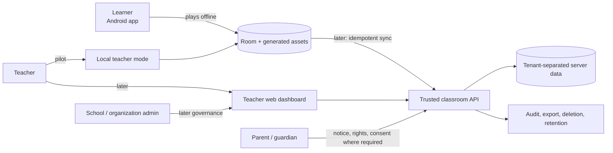
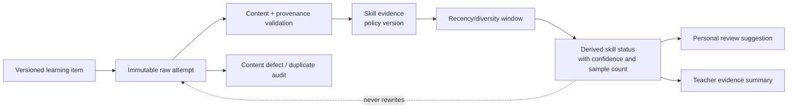
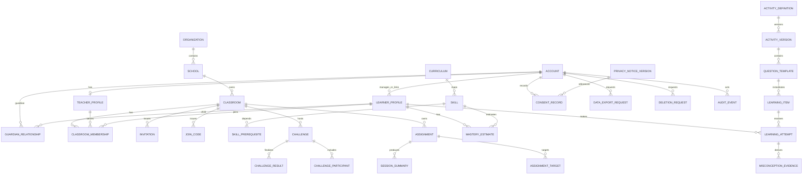
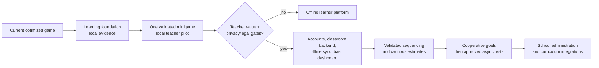

# Jigsaw Math Academy Platform Study

**Status:** Decision study; no implementation authorized

**Date:** 2026-07-16

**Decision horizon:** Foundations and sequencing, not a delivery estimate
**Legal note:** This is an engineering impact analysis, not legal advice.

## 1. Title, status, and date

This document evaluates whether the current Jigsaw Math Android game can evolve incrementally into a privacy-conscious learning and classroom platform. It separates the proposal into five decisions: learning foundations, multiple minigames, classroom product, safe challenges, and backend/synchronization. It does not assume that accepting one track requires accepting all of them.

Evidence labels used throughout:

- **Observed** — directly inspected in this repository.
- **Measured** — backed by a repository measurement with device/build context.
- **Documented** — stated by an official source, an ADR, or a cited primary paper.
- **Inferred** — a reasoned consequence of observed or documented facts.
- **Assumed** — a planning assumption that requires owner confirmation.
- **Unknown** — material information not yet established.

## 2. Decision sought

The owner should decide whether Jigsaw Math should pursue an academy direction **incrementally**, beginning with a versioned learning-evidence foundation and one locally validated minigame, while explicitly deferring child cloud accounts, classroom synchronization, predictive mastery, and social competition.

The immediate decision is not “build the academy.” It is whether to authorize a bounded discovery and foundation phase with these constraints:

1. pick one initial age/grade band and curriculum mapping;
2. retain offline-first Android learning;
3. record raw, local learning evidence separately from derived summaries;
4. validate one research mechanism and a privacy-minimized local teacher workflow;
5. require a child privacy impact assessment and legal review before any cloud pilot.

## 3. Executive recommendation

**Recommendation — adopt incrementally, with medium confidence.** Preserve the current Compose/libGDX/Room/DataStore architecture and add a pure-Kotlin, versioned learning domain beside the jigsaw-specific engine. First make current and new questions identifiable by skill, template, content version, assistance, and misconception opportunity; store local append-only attempts; derive cautious personal summaries; and test **Number Line Expedition** as the first new minigame. Then run a local, pseudonymous teacher pilot with no cloud accounts. Only if teachers find the reports actionable and the data model proves credible should the project authorize a backend classroom MVP. A later backend should use Room as the learner-side source of truth, an explicit idempotent outbox, server-authoritative memberships/assignments, and strict tenant authorization. Public profiles, unrestricted chat, public discovery, real-time multiplayer, permanent “weak” labels, and response-time-based mastery should be rejected for the initial platform.

Strongest support:

- **Observed:** the repository already has pure Kotlin state transitions, deterministic randomization, Room, DataStore, a lifecycle-owned libGDX surface, a deterministic asset generator, and performance tests. These are useful foundations rather than rewrite targets.
- **Documented:** randomized studies support particular learning mechanisms such as linear numerical representations, interleaving, comparison, self-explanation, and error correction, but the evidence is population- and implementation-specific.
- **Documented:** official privacy guidance requires purpose limitation, data minimization, child-oriented transparency, access/deletion controls, and—in the likely Philippine context—a child privacy impact assessment before launching child-accessible processing.
- **Inferred:** teacher analytics cannot be credible when the current durable record is puzzle completion and score rather than item-level evidence tied to stable skills and content versions.

Disadvantages and reversal conditions:

- The foundation adds content-governance and validation work before visible classroom features.
- A small team must support curriculum authorship, privacy operations, and teacher discovery in addition to software.
- Reverse or narrow this direction if teacher discovery shows no actionable use for the reports, if a target curriculum cannot be maintained responsibly, if a safe lawful account model cannot be established, or if a representative minigame does not improve the targeted outcome in a bounded evaluation.

Smallest safe next action: approve a non-production Phase 1 specification and content-tagging experiment for one grade band; do not select a backend vendor yet.

## 4. Idea interpretation

“Academy” is interpreted as a product family with shared learning contracts, not as a single giant application mode:

- **Track A — learning foundation:** stable skills, items, attempts, evidence, and transparent summaries.
- **Track B — activity platform:** independently testable minigames that report evidence through the same contract.
- **Track C — classroom product:** rosters, assignments, reports, export, deletion, and administrative lifecycle.
- **Track D — safe challenges:** optional, teacher-controlled cooperative or asynchronous modes.
- **Track E — backend and operations:** identity, tenant authorization, synchronization, audit, retention, and incident response.

**Inferred:** Tracks A and B can remain fully local. Track C can be piloted locally, but multi-device classrooms require Track E. Track D is neither a prerequisite nor a harmless extension; it introduces a distinct safety and verification surface.

## 5. Current repository baseline

### 5.1 Verified module graph

**Observed:** `settings.gradle.kts` declares seven modules:

```text
benchmark -> app
app -> core-game -> core-model
app -> core-data -> core-model
app -> renderer-gdx -> core-model
asset-pipeline -> core-model
```

| Module | Observed responsibility | Academy reuse | Current coupling |
|---|---|---|---|
| `app` | `MainActivity`, Compose navigation/screens, `GameViewModel`, HUD, `GdxPuzzleBoard` | Compose shell, lifecycle-aware UI, accessibility overlay | Four routes and one jigsaw session; hard-coded puzzle catalog |
| `core-model` | immutable game/progress models and `PuzzleManifest` | IDs, serialization/versioning patterns | `GameState`, actions, events, and progress are reveal/puzzle shaped |
| `core-game` | deterministic reducer, math question generator, scoring/difficulty | reducer pattern, seeded `RandomSource`, pure Kotlin testing | addition/subtraction choices and jigsaw piece progression |
| `core-data` | Room progress/session data, DataStore preferences, legacy migration | repository/data-source boundary, migrations, local source of truth | aggregate puzzle records, not learning attempts or sync |
| `renderer-gdx` | command queue, fragment bridge, puzzle texture/meshes/effects/disposal | resource ownership, fixed-step rendering, command isolation | commands and renderer are specifically puzzle-piece based |
| `asset-pipeline` | deterministic JVM texture/thumbnail/mesh/manifest generation | versioned deterministic generation pattern | one jigsaw asset type and one representative Cosmic task |
| `benchmark` | startup/profile journeys and baseline profile generation | performance harness | journeys and selectors target current screens/Cosmic Journey |

### 5.2 Important observed entry points

- **Observed:** `app/src/main/java/com/qtpie/simplepuzzle/MainActivity.kt` — `MainActivity` and `SimplePuzzleApp`; owns the current start/gallery/game/settings navigation and renderer fragment cleanup.
- **Observed:** `app/src/main/java/com/qtpie/simplepuzzle/viewmodel/GameViewModel.kt` — `GameViewModel`; adapts `DefaultGameEngine`, hard-codes five gallery entries, and sends coarse game state to Compose.
- **Observed:** `core-model/src/main/kotlin/com/qtpie/simplepuzzle/core/model/GameModels.kt` — `GameState`, `GameAction`, `GameEvent`, `Transition`; immutable but jigsaw-specific.
- **Observed:** `core-game/src/main/kotlin/com/qtpie/simplepuzzle/core/game/GameEngine.kt` — `DefaultGameEngine`; handles answer correctness, score, combo, reveal phase, completion, pause/resume, and restart.
- **Observed:** `core-game/src/main/kotlin/com/qtpie/simplepuzzle/core/game/QuestionGenerator.kt` — `DefaultMathQuestionGenerator`; produces deterministic addition/subtraction questions and unique options, but no stable skill/item/template metadata.
- **Observed:** `app/src/main/java/com/qtpie/simplepuzzle/ui/components/GdxPuzzleBoard.kt` — `GdxPuzzleBoard`; converts Compose-side changes into renderer commands.
- **Observed:** `renderer-gdx/src/main/java/com/qtpie/simplepuzzle/renderer/gdx/RendererCommand.kt` — `RendererCommand`; currently `SetVisiblePieces`, `RevealPiece`, effects, quality, pause, and resume.
- **Observed:** `renderer-gdx/src/main/java/com/qtpie/simplepuzzle/renderer/gdx/PuzzleRenderer.kt` — `PuzzleRenderer`; owns manifest/texture/meshes/batches/effects and disposes them.
- **Observed:** `core-data/src/main/kotlin/com/qtpie/simplepuzzle/core/data/progress/JigsawMathDatabase.kt` and adjacent entities/DAOs/repositories — Room v1 aggregate puzzle progress and session summaries.
- **Observed:** `core-data/src/main/kotlin/com/qtpie/simplepuzzle/core/data/preferences/PreferencesRepository.kt` — DataStore-backed preferences and the legacy migration marker.
- **Observed:** `asset-pipeline/src/main/kotlin/com/qtpie/simplepuzzle/assets/PuzzleAssetGenerator.kt` — deterministic JVM puzzle generator.
- **Observed:** `benchmark/src/main/java/com/qtpie/simplepuzzle/benchmark/CriticalUserJourneys.kt` — critical journeys, presently tied to “Cosmic Journey.”

### 5.3 Reusable abstractions

- **Observed:** `DefaultGameEngine.reduce` demonstrates a pure, immutable transition boundary that can be reused as a pattern for activity sessions.
- **Observed:** `RandomSource` and deterministic tests provide the right seed discipline for equivalent activities and reproducible content.
- **Observed:** Compose does not receive per-frame renderer state; it sends discrete commands through `PuzzleRendererController`.
- **Observed:** `PuzzleRendererFragment`/`PuzzleRendererHostViewModel` and controlled fragment removal establish explicit surface lifecycle and ownership.
- **Observed:** generated asset manifests carry a format version and source hash; this is a sound pattern for activity bundles.
- **Observed:** Room is already the structured durable store and DataStore is already limited to preferences.

### 5.4 Jigsaw-specific constraints that must not become the platform contract

- **Observed:** `GameState` includes `puzzleId`, `revealedPieces`, `pieceCount`, and a reveal-animation phase.
- **Observed:** correctness is followed by `RevealAnimationFinished`; this is appropriate for the jigsaw but not a generic learning-session transition.
- **Observed:** `DefaultMathQuestionGenerator` has only addition/subtraction operations and no `SkillId`, `LearningItemId`, misconception, hint, curriculum, or content-version fields.
- **Observed:** `app/.../model/Models.kt` duplicates UI math/settings models and includes a fallback random generator outside the deterministic domain path.
- **Observed:** `GameViewModel` uses a hard-coded catalog; four non-Cosmic cards reuse the Cosmic thumbnail.
- **Observed:** the renderer bridge and `RendererCommand` expose puzzle pieces rather than a renderer-neutral activity contract.
- **Observed:** `core-data` stores aggregate completion/best score/attempt count/session summaries, not append-only item attempts.
- **Observed:** `EmptyLegacyProgressSource` is the active legacy source, so no broader academy migration exists.
- **Observed:** the asset Gradle integration generates one representative jigsaw package; it is not a general activity bundle registry.

### 5.5 Baseline verification and performance context

- **Measured (this study):** `tools/android-doctor.ps1` passed; the SDK came from Android CLI and Java came from Android Studio's embedded JBR. No device or active Studio connection was available during this study run.
- **Measured (this study):** Gradle `projects` confirmed the seven modules; `:core-model:test :core-game:test` passed with eight tasks up to date.
- **Measured (repository):** `docs/PERFORMANCE_RESULTS.md` records a minified, profileable benchmark on an API 37 x86_64 60 Hz AVD. It does not establish physical-device thermals, high-refresh pacing, audio latency, or broad device memory behavior.
- **Measured (repository):** the recorded artifact snapshot is approximately 30.6 MB debug, 8.28 MB minified profileable, with one generated puzzle texture around 1.7 MB, thumbnail around 0.31 MB, and manifest around 97 KB. These are context, not an academy size budget.

## 6. Product vision and user roles

### 6.1 Proposed system context



### 6.2 Roles and boundaries

| Role | Initial value | Initial data visibility | Deferred capabilities |
|---|---|---|---|
| Independent learner | offline minigames and personal progress | own on-device summaries | cross-device account and cloud path |
| Student in local pilot | teacher-selected session on a controlled/shared device | own session feedback | self-service account, social discovery |
| Teacher | create local roster, select activity/skill, view cautious evidence, export/delete | only learners in own local class | multi-school analytics, predictive intervention claims |
| Guardian | child-friendly and adult privacy information; rights channel if cloud exists | only linked child where legally/operationally established | open social monitoring |
| School/organization admin | not needed in local pilot | none | ownership, teacher transfer, procurement, retention policies |
| Platform operator | content/version governance and support | minimized operational access | unrestricted child-level analytics access |

**Assumed:** the first academy experiment targets primary learners, but the exact ages, grade, curriculum, language, and school procurement model are unknown. Those choices precede content authoring and legal-basis design.

## 7. Assumptions and unknowns

| Item | Label | Consequence |
|---|---|---|
| Android remains the primary learner client | Assumed | preserve Compose/libGDX and offline assets |
| Teachers need a larger-screen workflow for sustained reporting | Inferred, not yet validated | web is a later candidate, not a Phase 1 dependency |
| Initial launch context includes the Philippines | Assumed from requested analysis | Philippine DPA/NPC review is mandatory before cloud processing |
| Some learners may be under 13 and the product is child-directed | Assumed and strongly indicated by product identity | COPPA/Play Families and child-specific design cannot be avoided by a cosmetic age gate |
| Controller relationship: direct-to-family, school-authorized, or both | Unknown | changes lawful basis, contracts, consent, rights, and account design |
| Exact curriculum and target language | Unknown | blocks stable skill taxonomy and content validity |
| Teacher willingness to manage join codes and reports | Unknown | must be tested before backend investment |
| Number of learners, schools, regions, and concurrent classes | Unknown | no capacity or cost claims are credible yet |
| Mastery estimates predict external learning outcomes | Unknown | dashboard must use evidence language, not mastery claims, until validated |
| Shared-device prevalence | Unknown | affects account switching, local separation, and deletion UX |

## 8. Constraints

- **Observed:** keep the current project buildable; no large simultaneous rewrite.
- **Observed:** the hot renderer path must remain free of Room, DataStore, network, bitmap decoding, mesh generation, and Compose state mutation.
- **Assumed:** core learning remains usable offline on mid-range and lower-end Android devices.
- **Inferred:** dynamic classroom content must be data, not executable downloaded game code.
- **Documented:** collect only data required for a named educational/operational purpose; retention cannot be indefinite by default.
- **Inferred:** assessment is formative. The product is not ready for grades, placement, diagnosis, high-stakes decisions, or permanent learner labels.
- **Assumed:** unrestricted chat, advertising, public child profiles, public discovery, and global leaderboards remain out of scope.
- **Unknown:** exact schedules and costs; neither is estimated here.

## 9. Strategic options

Rating terms in this section are qualitative: **low** means limited exposure/effort, **medium** means a new bounded subsystem or process, and **high** means multi-party operations, sensitive cloud data, or material safety risk. Each cell gives the reason for its rating.

| Option | User value | Architecture and migration | Backend / data | Runtime and APK | Test / operations | Privacy / safety | Reversibility | Decision |
|---|---|---|---|---|---|---|---|---|
| **0. Standalone jigsaw** | Learner: focused arithmetic game; no teacher value | No new platform boundary | Local aggregates only | Lowest change | Lowest burden | Lowest new exposure | High; current baseline | Viable fallback, but does not test academy value |
| **1. Learning foundation + offline minigames** | High learner breadth; indirect future teacher value | Medium: add versioned learning contracts and ordinary game modules | Room attempts; no accounts | Medium: lazy assets and per-game size budgets needed | Medium: content/conformance/research tests | Low-to-medium: local child data still needs transparency/deletion | High; new games can be removed | **Adopt now as prerequisite** |
| **2. Local classroom pilot** | Medium teacher workflow evidence; shared-device learner sessions | Medium: local roster/assignment/report feature | No cloud; pseudonymous profiles and export | Low runtime cost | Medium support/export/deletion burden | Medium: teacher device contains identifiable or linkable records | High if export format is documented | **Prototype after Track A contract** |
| **3. Classroom MVP** | High teacher/learner coordination if workflow is real | High: identity, classroom domain, network/sync/outbox, dashboard | Trusted backend required | Medium background/network cost | High authorization, sync, incident, support burden | High child records and tenant-leak risk | Medium; migrations and deletion commitments persist | **Defer until pilot, CPIA, and legal/controller decisions** |
| **4. Academy platform** | Potentially high value across learning paths and schools | Very high: content organization, adaptive logic, admin, multiple clients | Backend, operations, governance, analytics validation | High cumulative asset/cache risk | Very high product/content/ops burden | High, although controllable with governance | Low-to-medium after institutional adoption | Long-term direction only; incremental gates required |
| **5. Broad social platform** | Speculative engagement; weak initial teacher value | Separate real-time/social/moderation product | Real-time backend, moderation, reports, identity | High runtime/network complexity | Extreme moderation and abuse operations | Extreme child-safety, humiliation, discovery, contact risk | Low after network effects | **Reject for this repository's foreseeable scope** |

Option-specific implications:

- **Option 0:** no curriculum taxonomy, teacher workflow, or cross-game evidence; useful as rollback if academy hypotheses fail.
- **Option 1:** preserve existing saves by mapping old puzzle sessions to coarse historical activity results, not fabricating item attempts that were never recorded.
- **Option 2:** exports are privacy-sensitive artifacts; use explicit teacher confirmation, a documented schema, and deletion at pilot end.
- **Option 3:** requires server-authoritative membership, assignment versions, idempotent attempts, access revocation, export/deletion, audit events, backups, and incident response before launch.
- **Option 4:** requires a content team or governed authoring process; software alone cannot create curriculum validity.
- **Option 5:** is not “Option 4 plus chat.” It needs continuous moderation, reporting, abuse response, identity safety, and jurisdiction-specific social controls that a small team should not assume.

## 10. Learning-domain foundation

### 10.1 Why score is insufficient

**Observed:** current score combines correctness, combo behavior, and puzzle progression. It does not identify the mathematical skill, item/template, content version, assistance, misconception opportunity, or recency of evidence.

**Inferred:** a total score cannot distinguish these materially different cases:

- a learner accurately comparing magnitudes versus repeatedly adding within 20;
- an unassisted answer versus an answer after a hint;
- repeated exposure to the same generated template versus transfer to a new representation;
- a content defect versus a learner misconception;
- recent evidence versus a result from months ago;
- evidence from a valid item versus an ambiguous distractor set.

Score may remain a game reward. It must not be the source of truth for teacher analytics.

### 10.2 Minimum credible metadata

Before teacher analytics, every scorable item needs at least:

| Field | Minimum rule | Why it matters |
|---|---|---|
| `activityId`, `activityVersion` | stable, immutable version reference | separates mechanics/content changes |
| `sessionId`, `attemptId` | client-generated globally unique IDs | offline identity and idempotency |
| `itemId` or deterministic `templateId + seed` | reproducibly identifies what was shown | duplicate detection and audit |
| `contentVersion` | immutable catalog/taxonomy version | prevents silently reinterpreting old evidence |
| `primarySkillId` and optional weighted secondary skills | from a reviewed taxonomy | aggregation without claiming every item measures everything |
| `difficultyBand` | content-authored initially, not inferred from response time | contextualizes accuracy and cold start |
| `representation` | symbolic, verbal, number line, area model, etc. | transfer and accessibility interpretation |
| `response`, `correctness`, `expectedResponse` | structured, not free-form where avoidable | raw evidence and content debugging |
| `assistance` | hints, retries, worked step, reveal | assisted evidence must not equal independent evidence |
| `misconceptionOpportunity` and selected distractor tag | only where distractors were explicitly designed/validated | supports cautious pattern detection |
| `attemptOrdinal` and recent-exposure marker | within item/template/session | repeated practice is not independent evidence |
| timestamps | device event time plus eventual server receipt; monotonic duration where available | recency and sync without trusting wall clock for authority |
| app/content/engine versions | immutable provenance | diagnosis and migration |

**Inferred:** time-on-item can support usability and fluency research, but must not independently lower a learner’s mastery status. Pauses, disability, reading, device performance, distraction, and shared-device conditions confound it.

### 10.3 Versioned pure-Kotlin model proposal

This is a conceptual contract, not implementation:

```kotlin
@JvmInline value class SkillId(val value: String)
@JvmInline value class LearningItemId(val value: String)
@JvmInline value class ActivityId(val value: String)

data class SkillDefinition(
    val id: SkillId,
    val taxonomyVersion: Int,
    val title: String,
    val prerequisites: Set<SkillId>,
    val curriculumMappings: List<CurriculumMapping>
)

data class LearningItem(
    val id: LearningItemId,
    val templateId: String,
    val contentVersion: Int,
    val seed: Long?,
    val skillWeights: Map<SkillId, Double>,
    val difficultyBand: String,
    val representation: String,
    val misconceptionByResponse: Map<String, String>
)

data class LearningAttempt(
    val attemptId: String,
    val sessionId: String,
    val learnerId: String,
    val activityId: ActivityId,
    val activityVersion: Int,
    val item: LearningItemRef,
    val response: StructuredResponse,
    val outcome: AttemptOutcome,
    val assistance: AssistanceSummary,
    val occurredAtDevice: Instant,
    val elapsedMillis: Long?,
    val assignmentRef: VersionedAssignmentRef?
)

data class SkillEvidence(
    val attemptId: String,
    val skillId: SkillId,
    val evidenceKind: EvidenceKind,
    val weight: Double,
    val rationaleCode: String
)
```

Design rules:

- **Inferred:** canonical skill identity must be separate from curriculum alignment. One reviewed skill can map to different curriculum codes/versions without rewriting historical attempts.
- **Inferred:** raw attempts are append-only facts; corrections are explicit superseding records, not destructive edits.
- **Inferred:** `SkillEvidence` is a deterministic interpretation of an attempt under a named evidence-policy version. A later policy can recompute estimates without rewriting the attempt.
- **Inferred:** misconception evidence must describe “responses consistent with pattern X on these items,” never a diagnosis or permanent trait.
- **Inferred:** existing `PuzzleProgress` and scores migrate as historical activity summaries. Do not synthesize item-level evidence from aggregate counts.

### 10.4 Evidence-to-estimate flow



Recommended initial status vocabulary:

- `INSUFFICIENT_EVIDENCE`
- `DEVELOPING`
- `PRACTICED_RECENTLY`
- `REVIEW_SUGGESTED`

Do not use `weak`, `bad at`, `failed`, `below ability`, `mastered forever`, or a single unexplained percentage.

## 11. Multi-minigame architecture

### 11.1 Boundary design

**Recommendation — ordinary Gradle modules, adopted incrementally.** Dynamic feature modules add Play delivery, installation-state, navigation, test, and offline complexity before size data justifies them. Packages alone make asset and dependency ownership easy to blur. Start with contracts plus one ordinary feature module; revisit dynamic delivery only after measured APK/asset pressure and an offline availability plan.

Proposed dependency direction:

```text
core-model
  ^
core-learning (pure Kotlin taxonomy, items, attempts, evidence contracts)
  ^                 ^
core-game       feature-<activity>-domain (pure reducers/session logic)
  ^                 ^
app/Compose shell   feature-<activity>-android
                         |-- Compose accessibility/HUD
                         `-- optional renderer-gdx adapter

core-data -> core-learning + core-model
core-sync (later) -> core-data + network DTOs
```

No pure domain module may depend on Android, Compose, libGDX, Room, DataStore, or network clients.

### 11.2 Proposed contracts and ownership

| Contract | Layer | Responsibility |
|---|---|---|
| `LearningActivityDefinition` | pure Kotlin | ID/version, target skills, age/grade claims, supported session modes |
| `LearningActivitySession` | pure Kotlin | deterministic reducer state, selected item, attempts, completion |
| `LearningItem` | pure Kotlin | content identity, prompt structure, skill/difficulty/misconception metadata |
| `SkillEvidence` | pure Kotlin | versioned derivation from a raw attempt |
| `ActivityResult` | pure Kotlin | session outcome and references to attempts; not renderer state |
| `ActivityFactory` | application/domain boundary | constructs a session from definition, seed, content version, learner constraints |
| `ActivityManifest` | serialized data | compatible code version, activity/content IDs, asset hashes, locale, minimum capabilities |
| `ActivityAssetBundle` | asset/data boundary | immutable files and size/hash metadata; never executable remote code |
| `ActivityRenderer` | Android/render boundary | surface lifecycle, immutable snapshots, discrete commands, disposal |

**Inferred:** do not force `ActivityRenderer` into the pure learning contract. Some activities are accessible Compose forms; others benefit from a libGDX surface. The session contract should be independent of presentation.

### 11.3 Launch and reporting flow

1. Compose navigation selects `activityId`, `activityVersion`, assignment reference, learner profile, and seed policy.
2. An application registry resolves an installed, compatible `ActivityFactory`; unknown/incompatible content fails visibly and safely.
3. The pure session emits stable snapshots plus one-shot presentation events.
4. Compose owns prompt semantics, answer controls, pause/completion UI, and lifecycle.
5. An optional game-specific renderer receives only immutable render snapshots and explicit commands.
6. The session creates a structured `LearningAttempt`; a versioned evidence policy derives `SkillEvidence`.
7. `core-data` commits attempt, session summary, and outbox entry atomically when cloud sync exists.

### 11.4 Memory, startup, and asset rules

- Register metadata without instantiating all activities.
- Load the selected activity’s textures/audio only after navigation; unload on exit.
- Give every activity an explicit memory/asset budget and representative low-end benchmark.
- Keep thumbnails separate from gameplay textures.
- Use content-addressed immutable bundles with manifest compatibility checks and LRU/offline-pin policy when downloadable content exists.
- Never download executable dex/native code as “content.”
- Preserve one libGDX surface per active real-time activity; do not retain renderers in a global activity registry.
- Keep renderer commands bounded and ordered; reset one-shot event cursors after recreation without replaying audio/rewards.

### 11.5 Architectural case studies

| Dimension | Number Line Expedition | Worked-Example Detective | Strategy Shuffle |
|---|---|---|---|
| Research mechanism | linear spatial-number mapping and magnitude comparison | identify, explain, and repair a common erroneous solution | interleaved discrimination plus comparison of solution methods |
| Learner interaction | move a token/estimate a location, compare quantities, receive magnitude-specific feedback | inspect a fictional learner’s steps, select the first error/reason, repair it, then solve a transfer item | classify a problem, choose a strategy, solve, compare two methods, explain efficiency/validity |
| Required content | bounded number ranges, tick layouts, mappings among numeral/quantity/position, calibrated transfer items | authored worked steps, validated misconceptions, explanations, repairs, matched correct/transfer items | multiple problem families, strategy eligibility, paired solutions, discriminating mixed practice schedule |
| Pure domain | deterministic board/item generator, target position, structured response, hint policy, attempt/evidence | step graph, error location/type, response schema, feedback and transfer policy | item classifier, strategy choice, solution validation, interleaving schedule, comparison prompts |
| Rendering | libGDX for smooth token/board motion with Compose semantics/control overlay; static fallback for reduced motion | primarily Compose; libGDX is unnecessary unless decorative effects are isolated | primarily Compose for reading/choice; optional lightweight libGDX celebration only |
| Recorded evidence | estimate error, direction/magnitude, representation, hint use, transfer item accuracy | detected error, rationale, repair, misconception tag, delayed/transfer accuracy | correct strategy selection, solution accuracy, comparison rationale, switching errors |
| Teacher interpretation | “Recent evidence on locating/comparing numbers within range X”; show task variety and uncertainty | “Responses on these items were consistent with misconception X; review examples”; not a diagnosis | distinguish operation/strategy selection from calculation errors |
| Validation | usability/accessibility first; then active-control pre/post/follow-up on target numerical outcomes | immediate and delayed matched test; compare error-repair against ordinary problem solving | compare interleaved versus dosage-matched blocked practice and novel strategy-selection items |
| Likely failure modes | animation becomes reward race; motor/reading load; copying physical board aesthetics without contingent counting; weak transfer | excessive text, embarrassment if errors are framed as the learner’s, frustration, invalid misconception distractors | desirable difficulty mistaken for poor UX; too many categories; feedback reveals strategy before selection; reading confounds |

**Recommendation:** test Number Line Expedition first because its mechanism has direct early-numeracy evidence, the interaction is materially different from the jigsaw, and it exercises the renderer/activity boundary. This does **not** make the proposed mobile game “research proven.” It must preserve contingent movement/number mapping and validate transfer with the intended population.

## 12. Teacher and classroom architecture

### 12.1 Complete user flows

#### Teacher creates the first classroom

1. Local pilot: teacher creates a class on a controlled device, sees a child-data notice, chooses a retention date, and creates pseudonymous learner labels.
2. Cloud MVP later: verified adult account creates a classroom under a school/organization or documented individual-teacher context.
3. Server creates immutable classroom ID, teacher-owner membership, policy version, audit event, and an expiring/rotatable join code.
4. Teacher receives plain-language visibility rules and a roster with no public discovery.

#### Student joins

1. Learner enters a short code plus teacher-provided class alias/secondary confirmation; search never enumerates classrooms.
2. Server rate-limits attempts, validates code status/scope/expiry, and returns only minimal class confirmation.
3. A pending membership is approved automatically only under the class policy or explicitly by the teacher.
4. Device creates/links the local learner profile and pulls the minimum assignment catalog.

#### Teacher assigns a skill

1. Teacher selects curriculum/skill, activity versions, availability window in the class time zone, and target set.
2. Server validates teacher role and content compatibility, then writes an immutable assignment version.
3. Devices receive assignment ID/version/content hashes. Later edits create a new version; they do not reinterpret completed work.

#### Student completes work offline and synchronizes later

1. Room already contains the assignment version and required content bundle.
2. Session produces append-only attempts with client IDs/idempotency keys and a summary in one local transaction.
3. UI shows “saved on this device,” not “submitted,” until acknowledgment.
4. Unique WorkManager work sends pending mutations with retry/backoff.
5. Server checks membership at submission time, assignment/version policy, duplicate key, and content compatibility; it records server receipt time.
6. Device atomically marks accepted, duplicate, rejected, or needs-review; partial batches do not lose accepted items.

#### Teacher views results

1. Dashboard shows freshness (“synced through …”), evidence count, task variety, assistance, and `INSUFFICIENT_EVIDENCE` when appropriate.
2. Class patterns require a minimum group threshold; tiny cells and named peer comparisons are suppressed by default.
3. A teacher can drill from a derived summary to the underlying item categories/rationale, subject to legitimate educational interest.

#### Membership, access, and deletion exceptions

- **Student leaves or is removed:** server revokes membership immediately, stops new assignment access, and returns a revocation tombstone. Device removes or seals class data according to policy; unsynced attempts are quarantined for teacher/admin resolution rather than uploaded after revocation.
- **Teacher loses access:** sessions/tokens are revoked. A school-owned class remains with an authorized school admin; an independent-teacher class is frozen until recovery. Never transfer ownership based only on possession of a join code.
- **Join code is compromised:** teacher rotates/revokes it; server invalidates the old hash, rate-limits attempts, audits joins, and lets the teacher review/remove pending members. Existing legitimate memberships do not depend on the code afterward.
- **Learner uses multiple devices:** each device has a device-scoped installation ID and shared server learner ID; immutable attempt IDs deduplicate uploads. Server assignment/membership state wins; raw attempts merge append-only.
- **Account/class data is deleted:** authorize request; freeze new processing; enumerate primary data, replicas, exports, and processors; delete/anonymize according to legal retention; issue tombstones to devices; retain only a minimized proof-of-deletion/audit record if legally justified; report completion/failures. Backups need documented expiry rather than pretending immediate physical erasure.
- **Student removal versus record retention:** policy must distinguish revoking access from deleting school records. This requires school/legal direction, not an app default.

### 12.2 Teacher-experience alternatives

| Alternative | Strength | Weakness | Appropriate stage | Decision |
|---|---|---|---|---|
| No classroom | no account/privacy operations | no teacher value evidence | fallback | retain as rollback |
| Local teacher mode, no accounts | fast, offline, pseudonymous, validates workflow | one device, fragile collaboration, export burden | discovery pilot | **prototype first** |
| Android-only classroom MVP | one client/toolchain, offline capable | dense roster/report work is awkward on phones; teacher and learner concerns inflate app | only if teachers strongly prefer tablets and reports stay minimal | not default |
| Learner Android + separate teacher web dashboard | appropriate desktop workflows, independent deployment, easier school access | second frontend/toolchain, backend required, web accessibility/security/support | validated cloud classroom | **long-term preference** |
| Minimal Android teacher controls + later web | teacher can handle urgent roster/assignment tasks; web carries analysis | duplicated surface and role testing | staged cloud MVP | **recommended staged shape** |

Potential later web stacks must be compared in a separate implementation study:

- server-rendered Kotlin/Ktor: shared language/domain DTOs and a smaller client runtime, but the team must validate accessible component maturity and dashboard ergonomics;
- TypeScript with a mainstream SSR/SPA framework: mature dashboard/data-grid/accessibility ecosystem, but adds a language, package ecosystem, and duplicated model-generation pipeline;
- Compose Multiplatform web: potential UI sharing, but must prove browser semantics, accessibility, bundle/runtime behavior, and library maturity for admin tables before selection.

**Recommendation:** do not choose the web technology now. Establish teacher tasks, supported browsers, procurement/SSO needs, accessibility acceptance tests, and API contracts first.

## 13. Safe social and challenge architecture

### 13.1 Design principles

- Accuracy and explanation outrank speed; speed is optional tie-break data only for age-appropriate fluency tasks and never the sole mastery signal.
- Teachers opt a class into each mode and can stop, hide, or reset it.
- Default identity is teacher-managed pseudonym/avatar; no searchable public profile.
- Equivalent problem sets use server-issued activity/content version plus seed family, but equivalence must be content-tested, not assumed from equal random seeds.
- Results are provisional until the trusted service verifies assignment, seed token, nonce, attempt IDs, membership, and completion policy.
- Accessibility accommodations may change timing/input while preserving learning goals; a challenge must not expose the accommodation.
- Cooperative goals should use class progress thresholds that do not identify the learner who is “holding the class back.”

### 13.2 Challenge-mode matrix

Ratings combine educational fit, safety exposure, and operational burden; every rating includes its reason.

| Mode | Educational value / fairness | Safety and anxiety | Verification / abuse | Cost | Decision |
|---|---|---|---|---|---|
| Cooperative class goals | Medium-high: shared practice can support persistence if no learner is singled out | Low-medium: safe if contribution is private and targets are attainable | Low-medium: class membership and duplicate attempts still need checks | Medium | **Adopt incrementally after classroom MVP** |
| Async one-to-one | Medium: equivalent seeded practice; limited instructional advantage over assignments | Medium-high: invitations, rejection, comparison, replay, cheating | High: server-issued challenge token, nonce, deadline, version, finalization | High | Defer until evidence and reporting controls exist |
| Async teams | Medium: can emphasize cooperation, but team composition can stigmatize | High: exclusion, blame, visibility, teacher workload | High: roster snapshots, team changes, aggregate integrity | High | Prototype only with teacher-led design research |
| Class-only leaderboard | Low-medium: motivates some learners but rank does not teach | High: humiliation, anxiety, gaming; fairness across assistance/access | Medium-high: score policy and anti-cheat | Medium-high | Defer; prefer personal growth or cooperative goals |
| Student-created invite-only rooms | Unknown educational value | Very high: invitation abuse, exclusion, impersonation, moderation | Very high | Very high | Reject initially; later requires a separate safety case |
| Real-time multiplayer | Low incremental learning value over async | Very high pressure, connectivity inequity, conduct/moderation | Extreme authoritative state and abuse handling | Extreme | Reject for this repository |
| Public leaderboards/discovery | Weak educational value | Extreme public-child visibility and comparison | Extreme enumeration, impersonation, scraping | Extreme | Reject |
| Chat/messaging | Not necessary for the learning mechanism | Extreme contact, grooming, harassment, content moderation | Extreme reporting, evidence retention, blocking, crisis operations | Extreme | Reject |

**Documented:** a study of 125 fifth graders found cooperative gameplay most effective for positive math attitudes relative to competitive/no-game conditions, while a 2023 experiment with 274 children found both social contexts improved perseverance/attitudes but competition produced a condition-specific gender/attention difference. These results support careful cooperative tests, not a universal claim that cooperation always wins.

Safety/control implications by mode:

| Mode | Invitation and visibility | Moderation, reporting, blocking | Accessibility, fairness, and anxiety |
|---|---|---|---|
| cooperative goal | teacher enables for an existing class; individual contribution visible only to learner/authorized teacher; class sees aggregate | teacher can pause/hide goal and remove membership; no user content to moderate | accommodations do not reduce public contribution; no learner identified as delaying the goal |
| async one-to-one | teacher creates/approves pairing; no direct student invite in first version; pseudonyms only | teacher can cancel, block future pairing, and review a structured report; no messages | equivalent seeded families, accuracy first, private result, solo alternative, accommodation-safe timing |
| async teams | teacher creates teams and controls result visibility | teacher can reassign/cancel and report conduct outside the app; no team chat | avoid public individual contribution and fixed “ability teams”; audit uneven device/access conditions |
| class leaderboard | teacher-only enable and class-only aliases | teacher can hide/reset/remove result; names remain teacher-managed | high rank/anxiety risk even without abuse; prefer personal growth bands and no speed ranking |
| student-created rooms | student invitations create exclusion/contact paths | would require in-app report/block, invitation limits, evidence handling, and staffed response | high accessibility/social-comparison risk; therefore rejected initially |
| real-time multiplayer | participant presence/timing becomes visible | requires live conduct controls, disconnect/reconnect policy, reporting and moderation | connectivity, latency, disability, and time pressure undermine equivalence; rejected |
| public leaderboard/discovery | exposes identity/activity beyond the class | requires global reporting/blocking, impersonation/scraping response | unacceptable public comparison and discovery risk; rejected |
| chat/messaging | exposes user-generated content and contact graph | requires proactive/reactive moderation, report/block, retention, escalation, and crisis process | language/disability and harassment risks; no necessary learning benefit; rejected |

### 13.3 Cheating and result integrity

For later asynchronous challenges:

- server issues a signed opaque challenge token containing challenge ID, participant, activity/content version, seed-set ID, issue/expiry, and nonce;
- client never receives answer keys beyond what it needs item by item;
- attempts are append-only with idempotency keys; replays return the original result;
- server recomputes deterministic item identity/answer where possible and rejects unknown content versions;
- offline completion is allowed only when the challenge policy explicitly accepts delayed, unverifiable wall-clock timing;
- modified clients cannot be made impossible; label results as classroom game outcomes, not secure examinations;
- suspicious results trigger “needs review,” not automatic accusations or learner penalties.

## 14. Backend and synchronization

### 14.1 What requires a trusted backend

| Capability | Local-only possible? | Trusted backend required when… |
|---|---|---|
| independent play/personal progress | yes | cross-device restore/account is promised |
| local teacher roster/session/report | yes, one controlled device | multiple teacher/learner devices share data |
| join codes/invitations | no credible multi-device version | code must authorize a membership safely |
| assignments and deadlines | local teacher device only | distributed devices need server authority/time |
| teacher reports | local export possible | remote aggregation or multi-device freshness is promised |
| export/deletion | local delete/export possible | cloud/processor/backups must be enumerated and controlled |
| challenges | local pass-and-play only | participants are remote or results are finalized/shared |
| audit and role enforcement | no | any child record is remotely accessible |

### 14.2 Backend strategy comparison

This is a capability comparison, not vendor selection. “Rapid managed” is represented by Firebase Authentication + Cloud Firestore/Functions; “PostgreSQL-oriented managed” by Supabase/Postgres/Auth/Functions. A future procurement must re-check contracts, regions, pricing, child-directed SDK eligibility, and current service behavior.

| Strategy | Auth / authorization | Relational/reporting fit | Offline sync | Audit/export/deletion/region | Local tests / operations | Lock-in and pricing risk | Decision |
|---|---|---|---|---|---|---|---|
| **1. Remain local-only** | device/app boundary only | Room supports local relations | native because Room is canonical | explicit local export/delete; no remote audit | lowest operations | lowest vendor risk | Phase 1 and local pilot |
| **2. Rapid managed (Firebase)** | mature Android auth; Security Rules can implement roles but complex tenant rules require exhaustive emulator tests | document modeling makes multi-entity school reporting/constraints less natural | strongest built-in mobile cache; documented multi-write conflict is last-write-wins, which is wrong for some academy records | managed locations/backups/export exist; app-specific deletion/audit still must be built | Local Emulator Suite supports Auth/Firestore/Functions/rules; production differences remain | high API/data-model lock-in; per-read/write/index/listener billing can surprise reporting workloads | viable prototype candidate, not automatic choice |
| **3. Managed Postgres (Supabase-like)** | managed auth plus Postgres RLS; service-role bypass is dangerous and must stay server-side | strong relational constraints, SQL reporting, migrations, tenant policies | no equivalent official transparent Android offline database; app must keep Room/outbox/sync | managed backups/PITR/regions vary by plan; SQL makes export/migration tractable | Docker-based local stack and migration files; local stack is not production | moderate platform lock-in, lower data-model lock-in; per-project compute/backup costs | **best structural candidate to evaluate for classroom data** |
| **4. Custom Ktor + Postgres** | complete control, but team owns auth integration, authorization, token/session security | excellent | app still needs Room/outbox; server sync designed explicitly | full control and full responsibility for regions/backups/export/deletion/audit | Ktor test host is strong; deployment, monitoring, patching, on-call are all ours | lowest API lock-in, highest operational burden | defer for a small team unless managed limits become material |
| **5. Staged managed behind contracts** | start with a managed identity/data service but expose repository/sync DTO boundaries | can choose relational provider after pilot | Room/outbox never delegates correctness to vendor cache | portable IDs, exports, migrations, deletion ledger designed from start | adds boundary work but supports emulator/local contract tests | reduces, not eliminates, lock-in | **recommended backend posture after prerequisites** |

Verified documentation behind this comparison:

- Firebase documents automatic Android offline caching and last-write-wins for multiple changes to one document, role/security rules, local emulators, location selection, usage-based reads/writes, and managed backups ([offline data](https://firebase.google.com/docs/firestore/manage-data/enable-offline), [rules tests](https://firebase.google.com/docs/firestore/security/test-rules-emulator), [locations](https://firebase.google.com/docs/firestore/locations), [billing](https://firebase.google.com/docs/firestore/pricing), [backups](https://firebase.google.com/docs/firestore/backups)).
- Supabase documents a full Postgres database, Auth/Functions, RLS-oriented Kotlin access, Docker local development/migrations, dedicated compute billing, and plan-dependent backups/PITR ([platform](https://supabase.com/docs/guides/platform), [Kotlin](https://supabase.com/docs/reference/kotlin/installing), [local development](https://supabase.com/docs/guides/local-development/overview), [backups](https://supabase.com/docs/guides/platform/backups), [compute](https://supabase.com/docs/guides/platform/manage-your-usage/compute)).
- PostgreSQL documents per-command row-security policies; owners/superusers and roles with bypass capability require special care ([row policies](https://www.postgresql.org/docs/current/catalog-pg-policy.html), [role attributes](https://www.postgresql.org/docs/current/role-attributes.html)).
- Ktor supplies authentication plugins and an in-process server test harness, but deployment/container/SSL/operations remain application responsibilities ([authentication](https://ktor.io/docs/server-auth.html), [testing](https://ktor.io/docs/server-testing.html), [deployment](https://ktor.io/docs/server-deployment.html)).

**Observed compatibility note:** this repository currently supports Android API 24. The current Supabase Kotlin installation documentation states API 26 as its default minimum unless core-library desugaring is enabled. That is an evaluation constraint, not permission to raise `minSdk` or change dependencies; a future provider spike must prove API-24 compatibility and APK/runtime impact before selection.

### 14.3 Offline-first learner attempt and sync flow

```mermaid
sequenceDiagram
    participant UI as Activity UI
    participant Engine as Pure session
    participant Room as Room transaction
    participant WM as WorkManager sync
    participant API as Trusted API
    participant DB as Server DB

    UI->>Engine: structured response
    Engine-->>UI: transition + presentation event
    Engine->>Room: attempt + evidence refs + session + outbox
    Room-->>UI: saved locally
    WM->>Room: claim pending batch
    WM->>API: mutation(idempotencyKey, versions)
    API->>DB: authorize membership; insert-once
    DB-->>API: accepted / duplicate / rejected
    API-->>WM: per-item acknowledgement + server time
    WM->>Room: atomic acknowledgement / quarantine
    Room-->>UI: sync status update
```

Android’s official offline-first guidance says repositories should read from the local source of truth, write critical data locally first, and use persistent queues/WorkManager for deferred synchronization ([Build an offline-first app](https://developer.android.com/topic/architecture/data-layer/offline-first)).

### 14.4 Conflict and authority policy

| Data | Authority | Conflict rule |
|---|---|---|
| raw learning attempt | append-only client fact accepted by server policy | idempotent insert by attempt ID; never last-write-wins |
| assignment definition | server | immutable version; new teacher edit creates next version |
| membership/role/revocation | server | server wins immediately; device applies tombstone |
| learner display alias | teacher/server in classroom, local owner outside | versioned update with validation and audit |
| local preferences | device/profile | per-profile local; optional explicit account sync later |
| derived mastery | recomputable server or local policy | versioned model; never overwrites raw evidence |
| challenge result | server finalizer | client provisional; accept once for issued token/nonce |
| deletion | authorized server workflow | tombstone + processor/backups ledger; devices purge on next contact |

Additional sync rules:

- Client IDs are opaque random IDs; do not encode school, date of birth, or name.
- The server assigns canonical receipt/order metadata. Device wall clock cannot decide deadlines or winner order.
- Retries use exponential backoff and authentication-aware stop conditions; unauthorized is not blindly retried.
- A batch response acknowledges each mutation independently; accepted items are never resent as new attempts.
- Assignment packages are content-addressed and pinned before offline work begins.
- Revoked/deleted membership prevents new pulls and submissions even if the device remains offline; cached content is removed or sealed at next authoritative contact.
- Account switching closes the current session, cancels scoped work, clears in-memory renderer/audio state, and opens a separate encrypted-at-rest database or strictly partitioned profile. The exact storage design requires a threat-led implementation study.

## 15. Conceptual data model

### 15.1 Entity relationship overview



### 15.2 Logical entity catalog

“Sensitive” below is an engineering classification; qualified legal review must determine statutory classification and controller obligations. Retention must be a policy per purpose/jurisdiction, not an invented universal number.

| Entity | Purpose / owner | Sensitive fields and retention | Offline / authority / client mutability | ID, version, relationships |
|---|---|---|---|---|
| `Account` | authenticates adult or eligible learner; platform identity owner | email, auth provider, status; retain only while needed plus justified security records | cached token metadata only; identity service authoritative; client cannot set roles | opaque account ID; linked profiles/consents/audit |
| `LearnerProfile` | separates learning identity from login; learner/guardian/school context | alias, age/grade band, accommodations; avoid DOB unless required | needed offline; server authoritative when classroom-linked, locally mutable for independent use | opaque learner ID, profile version; memberships/attempts |
| `TeacherProfile` | verified adult teaching role | display/contact/verification state; review on role loss | minimal offline; server authoritative; self-edit safe fields only | teacher ID linked to account/memberships |
| `GuardianRelationship` | documents authority/link where required | relationship/status/evidence; retain only for active/legal purpose | generally server only; verified workflow, not child editable | relationship ID/version; account + learner |
| `Organization` | top-level contractual/tenant boundary | legal/contact/contract fields | metadata cache; server authority; admin mutations audited | organization ID/version; schools |
| `School` | school ownership/policy boundary | address/admin contacts may be personal | cache assigned school; server authority | school ID/version; organization/classes |
| `Classroom` | roster/assignment container | name, year, policy, teacher; archive/delete policy | assignments/roster subset offline; server authority in cloud | class ID/version; school/memberships |
| `ClassroomMembership` | role-scoped class access | learner/teacher link, status, dates | cached for authorization UX; server authority; explicit join/approve/revoke | membership ID/version; class/profile |
| `Invitation` | targeted invitation workflow | recipient contact if used; short retention after use/expiry | no need beyond pending UX; server authority | random ID, expiry, state; class/issuer |
| `JoinCode` | low-friction class join | hashed secret, scope, attempts; short-lived/rotatable | entered locally but validated server-side | code ID/version/expiry; class; never store plaintext server-side after display where avoidable |
| `Curriculum` | versioned external alignment | not personal | bundle/cache offline; content authority | curriculum ID/version; skill mappings |
| `Skill` | stable learning construct | not personal | fully offline; content authority, immutable per version | namespaced skill ID/taxonomy version |
| `SkillPrerequisite` | reviewed learning relationship | not personal | offline; content authority | composite skill/version IDs; confidence/rationale |
| `ActivityDefinition` | stable minigame identity/capabilities | not personal | installed catalog; content authority | activity ID; versions |
| `ActivityVersion` | immutable rules/content compatibility | not personal | pinned offline; content authority | activity + version; manifest/hash |
| `QuestionTemplate` | reproducible item family and metadata | not personal | installed/downloaded content; authoring authority | template ID/version; activity/skills |
| `LearningItem` | exact authored/generated stimulus | not personal unless free text is allowed (initially avoid) | generated/cached offline; deterministic/content authority | item ID or template+seed+version |
| `Assignment` | teacher instruction and availability | teacher, class, dates; school record | required offline; server authoritative; edits create versions | assignment ID/version; class/activity/skill |
| `AssignmentTarget` | class/group/learner targeting | directly reveals learner participation | needed offline for current learner; server authority | assignment + target ID/version |
| `LearningAttempt` | immutable raw evidence | learner link, response, assistance, time; minimize/free text excluded | created offline; client append-only; server validates/accepts | random attempt ID/idempotency key; item/session/assignment |
| `SessionSummary` | navigational/performance aggregate | learner, counts, status; derivable but useful offline | local transaction then server accepted | session ID/version; attempts/activity |
| `MasteryEstimate` | derived, versioned evidence summary | child profile/profiling risk; expire/recompute with policy | may cache offline; never client-authored; server/local estimator authority by context | learner+skill+model version+as-of watermark |
| `MisconceptionEvidence` | structured response pattern, not diagnosis | learner/attempt link and potentially sensitive inference | derived/cache; model/content authority | evidence ID/policy version; attempt/skill/tag |
| `Challenge` | teacher-enabled async/cooperative configuration | participant scope and policy | package may be cached; server issues/finalizes | challenge ID/version/seed-set/nonce policy |
| `ChallengeParticipant` | eligibility and state | learner/team membership | minimal offline; server authority | participant ID/version; challenge/learner |
| `ChallengeResult` | server-finalized outcome | performance and comparison visibility | provisional local, final server | result ID/version; challenge/attempt set |
| `ConsentRecord` | proof of notice/choice where applicable | identity, relationship, notice, method, time; legal retention | server record; append/supersede, never casual edit | consent ID; notice version/subject/scope |
| `PrivacyNoticeVersion` | exact adult/child notice text and scope | not personal | cache/display offline; publication authority | notice ID/version/locale/audience/hash |
| `AuditEvent` | security/administrative accountability | actor, target, IP/device metadata can be personal; strict access/retention | server only except local admin export log | append-only event ID, server time, reason |
| `DataExportRequest` | rights/school export workflow | requester, scope, delivery state; delete package promptly | server authority; status cache only | request ID/version; actor/subject/audit |
| `DeletionRequest` | rights/account/class erasure workflow | requester, scope, legal holds, processor status | server authority; device receives tombstones | request ID/state/version; subjects/audit |

### 15.3 Data minimization exclusions

Do not collect merely because it may be useful later:

- precise date of birth when an age/grade band is enough;
- exact home address, precise location, contacts, phone number, microphone/camera data;
- advertising IDs, cross-app identifiers, Wi-Fi/network identifiers;
- unstructured chat, biographies, public usernames, photos, voice recordings;
- keystroke/touch telemetry or continuous screen recordings;
- raw teacher notes about disability/health;
- device fingerprints for speculative anti-cheat;
- response time as a permanent learner trait;
- every renderer event, particle frame, or decorative interaction;
- inferred emotion, attention, or diagnosis;
- data from other apps or family members.

## 16. Learning analytics and mastery approaches

### 16.1 Model comparison

Ratings describe suitability for the first academy MVP. “Data need” is relative: low can work with a small evidence window; high requires calibrated item/learner histories and validation.

| Approach | Interpretability | Data / cold start | Hints, repeats, difficulty, prerequisites | Cross-game fit | Calibration / teacher risk | MVP decision |
|---|---|---|---|---|---|---|
| Simple rolling success rate | High, but easily misread | Low; unstable with few attempts | must manually exclude/down-weight hints/repeats; ignores item difficulty/prerequisites | weak unless item metadata comparable | low implementation, high misleading-risk if shown without counts/diversity | use only as a diagnostic ingredient, not a label |
| Recency-weighted evidence | High when window/weights shown | Low-medium; explicit insufficient state | explicit weights for assistance, repeats, item diversity, and age; prerequisites remain separate | good if skill/evidence contracts are shared | moderate; validate thresholds and sensitivity | **recommended core summary** |
| Rule-based mastery thresholds | High | medium; cold-start gate possible | rules can require independent/diverse/recent items | good but brittle across activity forms | easy to explain, false certainty near thresholds | use only for “review suggested,” not permanent mastery |
| Elo learner/item estimates | Medium; probability can be explained but updates are opaque to many teachers | medium-high; item difficulty needs interactions | extensions needed for hints, learning over time, multi-skill items | possible with careful calibration | model fit/drift/fairness testing required; may turn practice into rank | defer until sufficient cross-item data |
| Bayesian Knowledge Tracing | Medium-low to teachers | high per skill; prior/guess/slip/learn parameters have cold-start assumptions | naturally sequential but repeats and multi-skill mapping challenge assumptions | possible only with stable knowledge components | parameters and hidden-state claims can look more certain than data | defer; prototype offline only after validated taxonomy |
| Item Response Theory | Medium-low outside psychometrics | high, usually calibrated item bank and model-fit work | standard models are assessment-oriented; learning, hints, repeated exposure violate simple assumptions | difficult across heterogeneous games without linking studies | high psychometric validation burden; unsuitable for casual mastery claims | defer or reject for MVP |
| Insufficient-evidence state | Very high | correct at cold start | explicitly prevents forced conclusions | essential across all models | lowers harm and communicates uncertainty | **mandatory** |

### 16.2 Recommended MVP evidence rule

**Recommendation — adopt now at specification level.** For each skill, select a bounded recent window and compute a transparent evidence summary only after minimum independent, unassisted, item-diverse opportunities. Apply documented down-weights for hints/retries and near-duplicate templates. Report counts, content range, recency, and uncertainty. A rule may suggest review after a repeated recent pattern, but it must not declare a child deficient.

Example teacher language:

- Good: “On 7 recent independent items across 3 templates, Maya answered 4 correctly. Two responses matched the regrouping distractor. More evidence is needed before drawing a conclusion.”
- Good: “Review suggested: comparing two-digit magnitudes. Last practiced 12 days ago; evidence is limited.”
- Avoid: “Maya is weak at place value,” “mastery 42%,” “below ability,” “slow learner,” or “failed the skill.”

**Documented:** BKT originated as a model of procedural-rule acquisition in a tutoring context, Elo educational applications model learner/item response probability, and IRT is commonly used for calibrated large-scale tests; none automatically validates a young-child, multi-minigame dashboard ([Corbett & Anderson, 1994](https://doi.org/10.1007/BF01099821), [Pelánek, 2016](https://www.fi.muni.cz/~xpelanek/publications/CAE-elo.pdf), [ETS IRT introduction](https://www.ets.org/research/policy_research_reports/publications/report/2020/kbxx.html)).

## 17. Research review

The table records the study actually cited, not a generalized “games work” claim. “Causal” means the study used an experimental comparison supporting a causal claim within its design; it does not guarantee transfer to this product.

| Full citation | Population / sample | Design, intervention, comparison | Outcome and main result | Limitations / causal status | Direct mechanic support and Jigsaw Math validation |
|---|---|---|---|---|---|
| Ramani, G. B., & Siegler, R. S. (2008). *Promoting broad and stable improvements in low-income children's numerical knowledge through playing number board games*. Child Development, 79, 375–394. [doi](https://doi.org/10.1111/j.1467-8624.2007.01131.x) | 124 Head Start preschoolers, mean age about 4.75 | randomized within centers; linear numbered board versus matched color board; four 15-minute sessions | number-board group improved magnitude comparison, number-line estimation, counting, and numeral identification; gains persisted at follow-up | causal for this intervention/population; experimenter-led, small number range, low-income US preschool context | directly supports contingent movement on a linear numbered path; validate a digital active-control version on the target age, immediate and delayed magnitude/transfer items |
| Sella, F., Tressoldi, P., Lucangeli, D., & Zorzi, M. (2016). *Training numerical skills with the adaptive videogame “The Number Race”*. Trends in Neuroscience and Education, 5, 20–29. [paper](https://www.sciencedirect.com/science/article/pii/S2211949316300035) | 45 Italian middle-SES preschoolers; 5 absent at posttest | randomized game versus duration/setting-matched computer activity | larger improvement in mental calculation/spatial number mapping; smaller semantic-number improvement | causal within small single-preschool analytic sample; attrition and limited setting; transfer evidence remains bounded | supports adaptive digital magnitude practice, not a generic reward loop; preregister target outcomes and analyze attrition/usability |
| Räsänen, P., Salminen, J., Wilson, A. J., Aunio, P., & Dehaene, S. (2009). *Computer-assisted intervention for children with low numeracy skills*. Cognitive Development, 24, 450–472. [doi](https://doi.org/10.1016/j.cogdev.2009.09.003) | 30 low-numeracy kindergarten children; typically performing comparison group of 30 | randomized between Number Race and Graphogame-Math; daily for 3 weeks | both intervention groups improved number comparison, but not verbal counting, object counting, or arithmetic | active treatments lacked a randomized no-treatment group; small targeted sample; specific rather than broad transfer | warns that near-task gains may not transfer; require broader outcome tests before claims |
| Rohrer, D., Dedrick, R. F., & Stershic, S. (2015). *Interleaved practice improves mathematics learning*. Journal of Educational Psychology, 107, 900–908. [doi](https://doi.org/10.1037/edu0000001) | 126 seventh graders received the schedules; WWC’s reviewed contrast reports 63 | classroom cluster randomized, same problems over 3 months, interleaved versus blocked | interleaved practice improved later test performance despite greater practice difficulty | causal for selected graph/slope skills and school context; not early arithmetic or a game; cluster/sample scope matters | supports Strategy Shuffle’s discrimination schedule; validate against dosage-matched blocked practice and novel strategy selection |
| Rittle-Johnson, B., & Star, J. R. (2007). *Does comparing solution methods facilitate conceptual and procedural knowledge?* Journal of Educational Psychology, 99, 561–574. [doi](https://doi.org/10.1037/0022-0663.99.3.561) | 70 seventh-grade prealgebra students in one selective private school | experimental compare side-by-side methods versus study sequentially; worked packets with partner prompts | comparison improved procedural knowledge/flexibility; conceptual gains were not uniquely greater | causal within narrow algebra/school implementation; partner discourse and prompts may be essential | supports explicit method comparison, not mere random strategy mixing; validate explanation quality and transfer |
| Rittle-Johnson, B. (2006). *Promoting transfer: Effects of self-explanation and direct instruction*. Child Development, 77, 1–15. [paper](https://srcd.onlinelibrary.wiley.com/doi/10.1111/j.1467-8624.2006.00852.x) | 85 children ages 8–11, grades 3–5 | 2×2 instruction/invention and self-explanation/no explanation on mathematical equivalence | self-explanation and instruction supported procedure; self-explanation promoted transfer; neither uniquely improved an independent conceptual measure | causal within one topic/task; prompt quality and response coding matter | supports short structured “why” prompts; validate accessibility, completion quality, and transfer rather than prompt clicks |
| Adams, D. M., et al. (2014). *Using erroneous examples to improve mathematics learning with a web-based tutoring system*. Computers in Human Behavior, 36, 401–411. [paper](https://www.cs.cmu.edu/~bmclaren/pubs/AdamsEtAl-UsingErrExToImproveMathLearningWithWebTutoringSys-CHB2014.pdf) | 208 US middle-school students, ages 11–13 | erroneous-example critique/explain/correct versus isomorphic problem solving with feedback | no immediate difference; erroneous examples improved one-week delayed test (reported d=.62) and answer-judgment accuracy; learners liked ordinary problem solving more | causal within decimals/one school; delayed advantage and lower satisfaction; not younger arithmetic | directly supports Worked-Example Detective if misconceptions, explanations, repair, feedback, and delayed tests are retained |
| Rohrer, D., & Taylor, K. (2006). *The effects of overlearning and distributed practice on retention of mathematics knowledge*. Applied Cognitive Psychology, 20, 1209–1224. [abstract](https://digitalcommons.usf.edu/psy_facpub/1770/) | 216 college students | two experiments: massed versus two sessions one week apart; 3 versus 9 same-session problems | spacing benefited four-week retention; same-session overlearning did not improve later scores | causal, but adults and one taught procedure; no child/game evidence | supports later review scheduling as a hypothesis, not an age-general rule; validate with target learners and avoid compulsive reminders |
| Faber, J., Luyten, J. W., & Visscher, A. J. (2017). *The effects of a digital formative assessment tool on mathematics achievement and student motivation*. Computers & Education, 106, 83–96. [record](https://research.utwente.nl/en/publications/the-effects-of-a-digital-formative-assessment-tool-on-mathematics/) | 79 Dutch schools, 1,808 grade-3 students | school-randomized digital student/teacher feedback and adaptive assignments versus regular methods | positive achievement and motivation effects; effects higher for high-performing learners | causal at school level, but bundled intervention and intensity differences prevent isolating “analytics”; equity of benefit matters | supports testing teacher feedback plus adaptive work as a system; require subgroup/fidelity analysis and teacher-action evidence |
| Ke, F., & Grabowski, B. (2007). *Gameplaying for maths learning: cooperative or not?* British Journal of Educational Technology, 38, 249–259. [paper](https://bera-journals.onlinelibrary.wiley.com/doi/10.1111/j.1467-8535.2006.00593.x) | 125 fifth graders | assigned cooperative Teams-Games-Tournament, interpersonal competition, or no gameplay | gameplay outperformed drills; cooperative condition most positive for attitudes | causal/assigned design as reported, but older study, implementation-specific, social/classroom effects | supports testing teacher-led cooperation before rankings; measure attitudes, participation, and subgroup effects |
| Fish, L. R., Hildebrand, L., Chernyak, N., & Cordes, S. (2023). *Who's the winner? Children's math learning in competitive and collaborative scenarios*. Child Development, 94, 1239–1258. [paper](https://onlinelibrary.wiley.com/doi/10.1111/cdev.13987) | 274 US children ages 5–8, grades 1–2 | competitive, collaborative, or solo game teaching proportions | both social contexts improved perseverance/task attitudes; competition yielded a gender/age interaction on attention under conflicting cues | experimental and causal within novel proportion task; sample demographics and short intervention limit generality | shows aggregate motivation can hide subgroup harms; preregister subgroup/safety outcomes and retain a solo control |
| Dillon, M. R., Kannan, H., Dean, J. T., Spelke, E. S., & Duflo, E. (2017). *Cognitive science in the field: A preschool intervention durably enhances intuitive but not formal mathematics*. Science, 357, 47–55. [PubMed](https://pubmed.ncbi.nlm.nih.gov/28684518/) | 1,540 children, mean age 4.9, in 214 Indian preschools | randomized four-month math games versus active/no-treatment controls | durable gains on trained intuitive number/geometry; immediate symbolic gains, but no advantage in later formal school mathematics learning | strong field experiment; explicit failure of hoped-for formal transfer | central warning: engaging game gains are not academy proof; measure curriculum-relevant transfer and follow-up |
| Maki, K. E., Zaslofsky, A. F., Codding, R., & Woods, B. (2024). *Math anxiety in elementary students: Examining the role of timing and task complexity*. Journal of School Psychology, 106, 101316. [PubMed](https://pubmed.ncbi.nlm.nih.gov/39251303/) | 113 fourth/fifth graders | within-subject overt/covert timing × simple/complex tasks | no significant overt/covert timing anxiety difference; complex tasks produced greater anxiety; subgroup interaction occurred | causal within short assessment manipulation; does not prove competitive timers safe or beneficial | prevents simplistic “all visible timers cause anxiety” claims; any timer/challenge still needs task- and subgroup-specific evaluation |

### 17.1 Analytics-method provenance is not intervention evidence

| Source | Population/design | What it establishes | What it does not establish / product validation |
|---|---|---|---|
| Corbett, A. T., & Anderson, J. R. (1994). *Knowledge tracing: Modeling the acquisition of procedural knowledge*. User Modeling and User-Adapted Interaction, 4, 253–278. [doi](https://doi.org/10.1007/BF01099821) | methodological paper reviewing a series of studies of students learning short programs with the ACT Programming Tutor; the accessible record does not report one unified sample size and this is not a randomized child-math intervention | a hidden knowledge-state estimate can be updated from rule-level opportunities using prior/learn/guess/slip assumptions and evaluated against later performance | does not validate BKT parameters, skill mapping, teacher labels, or outcomes for young learners/minigames; Jigsaw Math would need held-out calibration, subgroup, and prospective decision-use validation |
| Pelánek, R. (2016). *Applications of the Elo rating system in adaptive educational systems*. Computers & Education, 98, 169–179. [paper](https://www.fi.muni.cz/~xpelanek/publications/CAE-elo.pdf) | methodological survey with an adaptive geography-fact case; no single randomized intervention population/sample | Elo-style updates can estimate learner/item response probability with extensions for educational practice | does not show causal learning gains or safe teacher interpretation; Jigsaw Math would need stable items, enough interactions, calibration/drift/fairness tests, and comparison with the transparent baseline |
| Livingston, S. A. (2020). *Basic Concepts of Item Response Theory: A Nonmathematical Introduction*. ETS Research Memorandum RM-20-06. [record](https://www.ets.org/research/policy_research_reports/publications/report/2020/kbxx.html) | conceptual methods report; no intervention, comparison group, learner sample, or causal result | explains calibrated item/ability response models used in large-scale testing | does not justify IRT for changing, assisted, repeated game practice; use would require psychometric expertise, item calibration/linking, model-fit and validity evidence |

## 18. Research-to-mechanic mapping

| Research-backed mechanism | Proposed product mechanic | Evidence level | Transfer risk | Product hypothesis and validation |
|---|---|---|---|---|
| contingent counting/movement on linear numbered space | Number Line Expedition token moves and position estimates | multiple experimental studies in early numeracy | medium: touch animation may replace spoken counting or spatial mapping | preserving contingent mapping improves targeted magnitude outcomes versus a matched nonnumeric/ordinary practice control |
| adaptive magnitude comparison | individualized range/distance/representation | small RCTs with mixed breadth of transfer | high for broad arithmetic claims | tune challenge without timers; test trained and untrained outcomes |
| interleaving requires strategy discrimination | Strategy Shuffle mixes problem families | classroom RCT in grade 7 | high for young learners/topics | interleaving improves delayed novel strategy selection, even if practice feels harder |
| compare alternative methods with prompts | side-by-side worked strategies | experiment in prealgebra | high across age/topic/digital format | structured comparison improves flexibility more than sequential display |
| self-explanation promotes transfer in a specific equivalence task | concise choice-plus-explanation prompts | child experiment | medium-high; superficial clicks may not reproduce mechanism | coded explanation quality predicts transfer; accessibility does not add excessive language load |
| critique/explain/repair erroneous examples | Worked-Example Detective | direct web-tutor experiment in middle-school decimals | medium within decimals; high for younger/other content | matched delayed test improves and frustration remains acceptable |
| spaced practice aids long-term retention | personal review suggestions | adult math experiment plus wider learning literature | high for age/content/notification design | a bounded schedule improves delayed skill performance without increasing disengagement |
| formative tool with teacher/student feedback and adaptive assignments | teacher evidence report and next-practice suggestion | large school RCT, bundled intervention | high: cannot isolate dashboard or algorithm | teachers understand and act on reports; learner outcomes/fidelity and subgroup effects are measured |
| cooperative context can improve attitudes | private contributions to class goal | classroom study plus newer mixed social evidence | medium-high across mechanics/class culture | cooperation improves participation/attitude without blame or subgroup harm versus solo/competitive alternatives |

**Conclusion — Documented + Inferred:** the mechanisms justify careful prototypes. The decorative theme, points, puzzle pieces, avatars, and challenges remain speculative mechanics until the exact implementation is evaluated.

No cited study establishes that coins, streaks, glow effects, unlocks, or faster animation improve mathematics learning. Treat them as motivation/usability hypotheses; test whether they support voluntary practice without crowding out explanation, encouraging excessive use, or becoming a proxy for mastery.

## 19. Privacy, child safety, and jurisdiction analysis

### 19.1 Jurisdiction and obligation matrix

| Context | Current official requirement/guidance | Engineering impact | Legal questions before cloud pilot |
|---|---|---|---|
| Philippines — Data Privacy Act (RA 10173) | transparency, legitimate purpose, proportionality; lawful processing; data-subject rights; security and accountability ([official Act](https://privacy.gov.ph/data-privacy-act/)) | purpose/data inventory, role/controller map, least privilege, retention, access/rectification/erasure/portability workflows, processor agreements | who is PIC/PIP for school use; lawful basis for each field; sensitive-data treatment; school/guardian authority; cross-border transfer |
| Philippines — child-oriented transparency | NPC Advisory 2024-03 applies to services intended/likely for children; requires age/risk-appropriate transparency and child impact assessment within PIA before launch, with continuing review ([advisory index](https://privacy.gov.ph/pips-and-pics/advisories-circulars/), [official FAQ](https://privacy.gov.ph/wp-content/uploads/2024/12/FAQs-Advisory-on-Guidelines-on-Child-Oriented-Transparency.pdf)) | child and adult notices, layered/visual language, CPIA gate, parental-involvement analysis, test comprehension with target ages | exact notice/parent involvement by age/risk; whether profiling or competition changes risk |
| Philippines — automated profiling/rights/breach | meaningful information about automated logic/significance is part of transparency; breach notification may be required under official criteria and timeframe ([right to be informed](https://privacy.gov.ph/the-right-to-be-informed/), [breach reporting](https://privacy.gov.ph/pips-and-pics/breach-reporting/)) | model version/rationale, human review, objection/rectification, incident inventory/triage/notification runbook | whether recommendations constitute solely automated decision-making or significant effects; notification applicability per incident |
| United States — COPPA | child-directed online services collecting personal information from under-13s need notice/consent and parent rights; school authorization is limited to school-benefit educational use, not other commercial purposes; operator remains responsible ([FTC FAQ](https://www.ftc.gov/business-guidance/resources/complying-coppa-frequently-asked-questions), [2025 final-rule summary](https://www.ftc.gov/news-events/news/press-releases/2025/01/ftc-finalizes-changes-childrens-privacy-rule-limiting-companies-ability-monetize-kids-data)) | no behavioral ads; data minimization; verifiable adult/school workflow; parent review/delete; separate third-party disclosure analysis; retention tied to purpose | commercial/nonprofit status; direct parent versus school authorization; current compliance deadlines and state student-privacy laws |
| United States — FERPA | for covered schools, provider under school-official exception must perform institutional function, remain under school direct control, limit use/redisclosure, and restrict access to legitimate educational interest ([FERPA regulations](https://studentprivacy.ed.gov/ferpa?exp=8), [provider guidance](https://studentprivacy.ed.gov/resources/responsibilities-third-party-service-providers-under-ferpa)) | contractual controls, school-owned records, role/tenant enforcement, export/access, deletion/return, no secondary profiling/ads | whether each participating institution is covered; contract/state requirements; record ownership and retention after removal |
| EU/EEA — GDPR child data | child data receives specific protection; Article 8 governs consent for information-society services where consent is the basis; Article 12 requires concise, intelligible child-directed language ([GDPR text](https://eur-lex.europa.eu/eli/reg/2016/679/), [EDPB children](https://www.edpb.europa.eu/topics/key-gdpr-concepts/children_en)) | controller/processor roles, lawful basis by purpose, DPIA analysis, data-subject rights, privacy by design/default, age/guardian verification proportional to risk, regional/transfer controls | target member states and digital-consent age; school/public-task basis; DPIA/representative/DPO/transfer duties; profiling safeguards |
| Google Play Families | apps including children in target audience must accurately declare audience/data practices; child data and SDK restrictions apply; child-only apps must avoid listed persistent identifiers/location and are subject to social/ads rules ([Families policy](https://support.google.com/googleplay/android-developer/answer/9893335), [target audience](https://support.google.com/googleplay/android-developer/answer/9867159)) | SDK inventory and child-directed eligibility review, privacy policy/data safety accuracy, no AD_ID/precise location, no open chat, review credentials for gated app | exact target-age declaration; each auth/analytics/crash SDK’s child-directed terms and data behavior |

### 19.2 Privacy-minimized initial scope

The product can reduce—not eliminate—risk by beginning with:

- local-only learning evidence;
- a teacher-controlled local pilot with pseudonymous labels and no student email/account;
- no advertising and no third-party behavioral analytics;
- no public graph, profiles, discovery, chat, or direct messages;
- no exact DOB/location/contact collection;
- explicit pilot retention end and one-action class deletion/export;
- aggregate class reporting with minimum-cell suppression;
- school-controlled invitations only when cloud exists;
- staged adult accounts before learner accounts;
- a CPIA/PIA and child-notice comprehension test before cloud collection.

**Inferred:** “pseudonymous” does not mean anonymous. A teacher can link an alias to a child, and learning records remain personal data in context.

### 19.3 Third-party SDK policy

Before a cloud or analytics SDK is added:

1. inventory every transmitted field/identifier and destination;
2. verify child-directed contractual eligibility and processor/subprocessor terms;
3. disable advertising, cross-app tracking, unnecessary collection, and automatic screen/user-content capture;
4. test network behavior on a clean device and after opt-out/account deletion;
5. document region, retention, access, deletion, breach, and export behavior;
6. update CPIA, privacy notices, Play Data safety, and incident inventory;
7. provide a no-SDK or first-party alternative when practical.

### 19.4 Qualified legal review questions

- Who is controller/PIC and processor/PIP in direct-to-family versus school deployments?
- Can a teacher alone authorize use, or must school administration/guardian participate for the chosen jurisdiction and data?
- Which lawful basis applies separately to accounts, assignments, learning evidence, support logs, security logs, research, and product analytics?
- Is a mastery/recommendation system profiling or solely automated decision-making with legal/significant effect?
- What student-record retention, parent access, school transfer, and deletion duties apply?
- What cross-border transfer mechanism and hosting region are acceptable?
- What age/guardian verification is proportionate and non-deceptive?
- What breach notification and child/school communication timelines apply?
- What state/local student privacy and procurement rules apply beyond COPPA/FERPA?
- May de-identified research data be retained, and what de-identification/re-identification controls are required?

## 20. Security threat model

| Threat | Asset / attack | Prevention | Detection / response | Residual risk |
|---|---|---|---|---|
| privilege escalation | learner changes role/tenant IDs or calls admin endpoint | server derives role from authenticated membership; deny by default; RLS/API checks; no client-set role | authorization matrix tests, denied-access audit, alerts | policy/config defects remain high-impact |
| forged attempts | modified client invents correct answers | deterministic item/version validation, server acceptance policy, signed assignment/challenge references | anomaly/content-version reports; mark review, never punish automatically | ordinary homework cannot be exam-secure |
| teacher impersonation | child creates teacher account or steals session | adult/school verification, MFA/recovery, short-lived tokens, reauth for export/delete | login/recovery audit, revoke all sessions | account recovery social engineering |
| leaked join codes | code posted/shared or brute-forced | high entropy, expiry, rotation, rate limiting, pending approval, no enumeration | join velocity/location anomaly, teacher roster review | intentional sharing cannot be eliminated |
| classroom enumeration | API reveals names/existence from code/search | opaque IDs, generic errors, no public search, throttling | enumeration-rate alerts | side channels in response timing/support |
| student-record access | teacher reads another class/school | tenant + membership + legitimate-interest checks on every query; scoped exports | cross-tenant negative tests, immutable audit, periodic access review | backend/admin bypass requires governance |
| insecure local storage | shared/compromised device exposes Room/files/tokens | minimize cache; Android Keystore-backed secrets; profile isolation; logout/purge; no secrets in logs | device/session inventory, remote revoke, rooted-device risk notice where appropriate | compromised unlocked device can expose visible data |
| replay attacks | repeat join, mutation, or challenge result | nonce, expiry, idempotency key, insert-once semantics, server receipt | duplicate counters and audit | offline challenge timing remains weak |
| abusive student rooms | exclusion/contact via invitations | do not build student-created rooms initially; teacher-only creation | reporting/blocking if ever introduced | rejected feature has near-zero current exposure |
| malicious display names | slurs, impersonation, PII | teacher-managed alias, length/character rules, no public display | teacher rename/remove; audit | filters cannot catch all context |
| backend misconfiguration | open rules/RLS or public backups | infrastructure/migration review, deny-default policies, separate environments, automated authorization suite | configuration scanning and canary tenant tests | privileged misconfiguration remains critical |
| exposed service credentials | key committed or embedded in app | no privileged key in client; secret manager; least privilege; rotation | secret scanning, usage alerts, emergency rotation | public client keys still rely on correct server policy |
| compromised device/account | attacker exports or changes class | reauth/MFA for sensitive actions, scoped sessions, device revoke, least privilege | access/export alerts and audit | authorized session can view entitled data |
| deletion failure | primary rows deleted but cache/export/backup persists | deletion inventory/state machine, processor callbacks, tombstones, backup expiry policy | reconciliation job and completion evidence | backups cannot always be instantly erased; disclose accurately |
| sync conflict/data loss | partial retry duplicates or drops evidence | atomic local transaction, append-only attempts, per-item ack, idempotency, quarantine | outbox age/failure dashboards without child content | long offline periods and app uninstall can lose unsynced local-only data |
| denial/abuse of reports | repeated export, code attempts, expensive queries | quotas, rate limits, pagination, role checks | rate/cost alerts and temporary containment | teacher support impact |

Security acceptance gate for any cloud classroom: a complete role/resource/action authorization matrix must pass negative tests for unrelated learner, class, school, removed member, expired invite, compromised join code, support staff, and service-role paths.

## 21. Android, Compose, libGDX, and performance implications

### 21.1 Teacher assignment flow

```mermaid
sequenceDiagram
    participant T as Teacher UI
    participant API as Classroom API
    participant DB as Server authority
    participant Sync as Learner sync
    participant Room as Learner Room
    participant A as Activity factory

    T->>API: create assignment(skill, activityVersion, targets, window)
    API->>DB: authorize teacher; write immutable version
    DB-->>T: assignmentId + version
    Sync->>API: pull changes after watermark
    API-->>Sync: assignment + manifest hashes + server time
    Sync->>Room: transactionally cache assignment/content refs
    Room-->>A: launch exact compatible version offline
    A-->>Room: attempts + session + outbox
```

### 21.2 Compose state

Compose should contain only coarse, lifecycle-aware activity state:

- activity/session ID and version;
- prompt/answer UI model and accessibility semantics;
- score/reward presentation where game-specific;
- progress, assistance, selected response, pause/completion;
- assignment sync/freshness status;
- teacher-safe evidence summary;
- immutable renderer snapshot reference and one-shot command cursor.

It must not contain particle positions, frame delta, continuously changing transforms, trail points, glow radius, physics state, texture handles, Room entities, network clients, or an Activity reference. `collectAsStateWithLifecycle` remains the UI collection pattern. One-shot renderer/audio events need consumed IDs scoped to a session and surface generation to prevent replay after process recreation.

### 21.3 libGDX lifecycle and reuse

The existing host pattern can be generalized, but each activity renderer remains game-specific:

1. Compose navigates to an activity and obtains a renderer descriptor, not a renderer singleton.
2. The Android host creates exactly one surface and a renderer-owned asset scope.
3. The renderer consumes immutable snapshots and ordered commands only.
4. Pause/background sends a discrete command and lifecycle pause; resume clamps delta and restores from coarse session state.
5. Surface recreation reloads GPU objects from an immutable bundle; it does not replay learning attempts or rewards.
6. Navigation exit detaches listeners, removes the fragment/view, stops renderer-timed audio, clears the command queue, and disposes meshes/textures/batches/effects.
7. Low-memory releases optional effects/caches; the pure session and Room record remain valid.

Number Line Expedition may reuse common renderer infrastructure—fixed-step loop, quality profiles, particle pool, asset owner—but not `PuzzleRenderer` or puzzle-piece commands. Worked-Example Detective and most of Strategy Shuffle should remain Compose-first because a GPU surface would add lifecycle and accessibility cost without a real-time rendering need.

### 21.4 Performance and delivery implications

| Concern | Implication | Required control |
|---|---|---|
| startup | eager registration/loading of all minigames would erode current startup | metadata-only registry; lazy code/asset construction; benchmark cold title and first activity |
| APK size | every texture/audio pack accumulates even if never played | per-activity size report, shared atlas only for truly shared assets, content bundles/download decision based on measurements |
| memory/texture limits | multiple retained renderers could exceed low-end GPU memory | one active renderer, explicit disposal test, texture max-dimension validation, LOW profile |
| dynamic content | incompatible manifest/code can crash or mis-score | min/max runtime compatibility, hash/signature, content version pinning, safe unavailable UI |
| offline cache | assignments may depend on assets when disconnected | preflight/pin package, quota/LRU, protect active assignments, teacher-visible availability |
| background sync | continuous listeners waste battery/data | Room-first reads, constrained unique WorkManager jobs, batching/backoff, no renderer/network coupling |
| process death | session/reward events may duplicate | persist coarse session/attempt IDs; deterministic restoration; never persist GPU state |
| shared devices | wrong learner can see/submit another learner’s work | explicit profile chooser/lock, visible active alias, scoped database/work/audio/renderer teardown |
| adaptive layouts | teacher and learner controls span phones/tablets/foldables | window-size layouts, minimum touch targets, keyboard/screen-reader tests; no mockup coordinates |
| low-end devices | richer game set can regress frame pacing | renderer benchmark per real-time game on representative low/mid devices; reduced motion/LOW effects |

**Measured limitation:** no academy code or asset exists, so no FPS, memory, startup, APK growth, or network/battery change is measured. The repository’s current benchmark results are only a baseline.

### 21.5 Cross-cutting implication checklist

| Dimension | Study conclusion |
|---|---|
| target ages/grades | **Unknown:** choose one band before taxonomy or claims. Number-line evidence is strongest for preschool/early primary; worked-error/interleaving studies include older learners and cannot be silently generalized. |
| learning objectives/curriculum | canonical skills and versioned curriculum mappings must precede analytics; the platform remains formative, not summative/high-stakes |
| teacher/learner value | learners gain activity breadth locally; teacher value is a hypothesis tested by actionable next-step reports, not dashboard usage |
| classroom/home use | independent home mode can remain local; local teacher pilot supports shared sessions; multi-device classroom use requires a backend |
| math anxiety/competition | show challenge difficulty and uncertainty carefully; keep solo paths; measure subgroups; never make rank/speed the default learning signal |
| accessibility/equitable access | support screen readers, large text, reduced motion, non-timed alternatives, keyboard/switch-friendly controls, low-end devices, shared devices, and intermittent connectivity |
| current module fit | add pure learning contracts and ordinary activity modules; do not widen jigsaw `GameState`/`RendererCommand` into universal abstractions |
| backend/API boundary | transport DTOs and sync live outside pure learning; local Room is read source of truth, while server owns remote membership/assignment authority |
| versioning/feature flags | version taxonomy, content, activity, evidence policy, API, assignment, and notice; flags stop use but do not erase data obligations |
| data/migrations | preserve aggregate legacy progress as historical summaries; add raw attempts/outbox only through tested Room migrations; DataStore stays preference-only |
| account switching/backup | fully tear down scoped work, renderer/audio, and visible learner state; restore/export/delete must preserve tenant and version integrity |
| security/privacy | authenticate adults appropriately, authorize every tenant resource, minimize PII, perform CPIA/PIA, and test joins/revocation/export/deletion |
| testing/observability | deterministic domain/content tests, renderer lifecycle tests, sync chaos and authorization tests, accessibility/benchmark tests, and minimized operational logs are all release gates |
| delivery/operations | content authorship, privacy rights, incident response, teacher support, moderation boundaries, vendor management, and rollback are product work, not post-launch extras |

### 21.6 Audio and haptics

Retain the existing centralized preference model, but scope playback to the active activity/session:

- Compose/Android owns accessibility and user preference coordination; renderer-timed sounds may remain in the active libGDX renderer.
- Activity assets declare audio IDs and hashes; entering multiple games must not load every sound bank.
- Surface/session recreation must not replay completion/correct-answer audio or haptics; one-shot event IDs are consumed once.
- Background, account switch, class switch, and navigation exit stop activity audio and release renderer-owned sound/music.
- Teacher/classroom mode needs a fast mute option and should default to respectful shared-space behavior determined through pilot feedback.
- Haptics remain optional, reduced-motion/sensory settings are honored, and absence of haptic hardware is not an error.

## 22. Testing and observability

### 22.1 Test strategy by boundary

| Boundary | Minimum tests before release |
|---|---|
| taxonomy/content | stable unique IDs, acyclic prerequisites, valid curriculum mappings, locale completeness, retired-version behavior |
| activity conformance | deterministic same seed/version, valid items/responses, no duplicate choices, assistance semantics, attempt/evidence schema, pause/restart/process restore |
| evidence policy | raw attempt never mutated; repeat/hint/down-weight rules; insufficient evidence; recency; version recomputation; explainable rationale |
| Room | schema migration from current v1, aggregate preservation, attempt/outbox atomicity, account partition, tombstones, reset/export |
| DataStore | profile-safe preferences, graphics/reduced motion, migration; classroom records never placed here |
| renderer | command order/idempotency, surface generation, pause/resume delta clamp, low-memory, asset incompatibility, disposal/no retained Activity |
| Compose | state/event duplicate prevention, semantics, keyboard/screen reader, large font, reduced motion, adaptive sizes, offline/freshness states |
| sync | idempotency, duplicate submission, partial batch, clock skew, backoff, auth expiry, assignment versions, revocation, deletion, multi-device merge |
| API/auth | full role-resource-action allow/deny matrix, tenant isolation, field validation, rate limits, enumeration resistance, service-role paths |
| export/deletion | scope accuracy, authorization/reauth, processor/backups ledger, tombstones, retry/reconciliation, expired download |
| research/content | active comparison, predeclared outcomes, attrition/fidelity, subgroup/accessibility, delayed and transfer assessments |
| minigame performance | cold launch, first frame, repeated enter/exit, 10 rapid actions, background/resume, allocations, memory, low profile |

Use fakes for clocks, random sources, repositories, sync transport, model policy, and dispatchers. No test should depend on arbitrary delays. Contract fixtures must include forward/unknown versions and malicious payloads.

### 22.2 Benchmarks

Extend the existing Macrobenchmark/Baseline Profile pattern only when features exist:

- cold title and personal-progress launch;
- navigation to each minigame and first meaningful frame;
- first response/feedback and ten rapid responses;
- background/resume mid-session;
- repeated enter/exit verifying memory recovery;
- gallery/activity catalog scroll with unloaded assets;
- assignment sync from offline to online;
- teacher roster/report on target tablet/browser separately.

Baseline Profiles improve code paths; they do not excuse eager assets, renderer leaks, large Room queries, or excessive network reads. Perfetto claims require an actual trace, build type, device, refresh rate, scenario, and before/after commit. Child-level identifiers must not appear in trace names, logs, screenshots, crash reports, or benchmark fixtures.

### 22.3 Privacy-preserving observability

Collect operational metrics only when a named purpose and retention exist:

- acceptable: aggregate API latency/error category, sync queue age/count, authorization denials, content-version failures, renderer frame metrics on opt-in test builds, deletion workflow state;
- avoid: raw answers in logs, learner names, class join codes, full URLs/tokens, free text, precise device location, cross-app IDs;
- use separate security audit events for sensitive actions and tightly restrict access;
- sampling/aggregation thresholds must prevent small-class re-identification;
- analytics correctness must be tested like financial logic: numerator, denominator, exclusions, time windows, model version, and late-arriving data.

## 23. Operational and maintenance implications

### 23.1 Small-team viability

**Inferred:** Options 1 and a bounded Option 2 pilot are viable for a small team if scope is limited to one grade band and one new minigame. Option 3 is not merely an Android feature; it creates ongoing identity, security, privacy-rights, data-retention, teacher-support, content-support, and incident-response duties.

Minimum enduring functions before a cloud pilot:

- product owner with authority to constrain scope;
- curriculum/content reviewer and version owner;
- privacy lead/DPO advice and qualified legal review;
- backend/security ownership, on-call and incident runbook;
- teacher support and account recovery process;
- deletion/export and processor reconciliation owner;
- research/evaluation partner where learning claims are tested;
- accessibility review with target users.

### 23.2 Content operations

Every activity version needs:

1. target population and skill specification;
2. item/template author review and misconception rationale;
3. deterministic validation/generation;
4. locale and accessibility review;
5. content QA against ambiguous/impossible items;
6. compatibility and asset-size report;
7. outcome/transfer validation plan;
8. immutable release plus retirement/rollback policy.

**Inferred:** a teacher marketplace or open user-authored questions should not be added initially. Moderating mathematical correctness, child-appropriate text/images, copyright, and malicious content would exceed current controls.

### 23.3 Deployment and rollback

- Feature flags may hide a client feature but cannot remove already collected data obligations.
- Server schema/API changes require backward-compatible windows for offline clients.
- Content is immutable by version; rollback changes the assignment/catalog pointer, not historical evidence.
- Maintain provider-neutral export and tested restore before relying on a managed backend.
- Backups, retention, and incident response must be exercised, not merely configured.
- Teacher support needs status visibility for pending sync, revoked access, code rotation, and deletion without exposing child content to support staff by default.

## 24. Decision matrices

The six required decisions are intentionally separate:

1. **Strategic product scope:** Section 9.
2. **Teacher-experience architecture:** Section 12.2.
3. **Backend strategy:** Section 14.2.
4. **Mastery-estimation approach:** Section 16.1.
5. **Challenge modes:** Section 13.2.
6. **Candidate research-informed minigames:** below.

### 24.1 Candidate minigame matrix

Ratings are relative to the current repository. Educational confidence is **medium** only where a mechanism has relevant experiments but the exact app remains unvalidated; none earns “high.” Runtime cost reflects likely Android load, while data/safety risk reflects the evidence collected and experience, not only computation.

| Candidate | Learner / teacher value | Educational confidence | Architecture fit / runtime | Implementation / testing | Data / child-safety | Reversibility / confidence | Decision |
|---|---|---|---|---|---|---|---|
| Number Line Expedition | high for early magnitude; teacher sees interpretable location errors | medium: direct early-numeracy mechanism, uncertain digital transfer | high fit for pure reducer + dedicated libGDX; medium GPU/asset cost | medium-high: touch mapping, adaptive items, active-control/transfer tests | low: structured responses; avoid speed rank | high removal/versionability; medium recommendation confidence | **first experiment** |
| Worked-Example Detective | high for misconception discussion; strongest delayed digital evidence in decimals | medium for older learners/decimals, low-to-medium for younger arithmetic | high Compose fit; low runtime cost | high content/testing cost: authored errors, explanations, delayed measures, reading accessibility | medium: misconception inferences can stigmatize | high technical reversibility; medium educational confidence only for matched population/content | second candidate after content capability |
| Strategy Shuffle | high potential for strategy selection/flexibility; strong teacher diagnostic distinction | medium in grade-7 evidence, low for initial young audience until tested | high Compose/domain fit; low runtime, low asset cost | high: multiple strategies, interleaving fidelity, explanation scoring and transfer | medium: practice difficulty may discourage; careful feedback | high technical reversibility; low-medium target-population confidence | prototype after taxonomy spans multiple strategies |

### 24.2 Cross-matrix synthesis

- **Learner value:** Option 1 plus Number Line Expedition yields meaningful breadth without accounts.
- **Teacher value:** a local pilot tests whether evidence can change instruction before a dashboard is built.
- **Architecture fit:** ordinary modules and a pure learning contract fit current dependency direction; widening `GameState` into a universal engine does not.
- **Complexity:** sync/authorization/privacy dominate classroom complexity; renderer reuse is secondary.
- **Runtime:** multiple activities are safe only with lazy construction, one active renderer, and asset budgets.
- **Data and safety:** social features have the weakest value-to-risk ratio; raw learning evidence has value but requires minimization and careful language.
- **Reversibility:** local foundations are highly reversible; cloud records, institutional promises, and social networks are not.

## 25. Risk register

Likelihood is an informed qualitative estimate before implementation: **low**, **medium**, or **high**. Impact is the plausible consequence if triggered, not a prediction of harm.

| Category / risk | Trigger | Likelihood | Impact | Subsystem | Detection | Mitigation | Containment / rollback | Residual risk |
|---|---|---|---|---|---|---|---|---|
| Educational validity | attractive mechanic omits the studied learning mechanism or tests only near transfer | high | high: ineffective claims/content | content/activity | active-control, delayed and transfer measures | mechanism spec, expert review, preregistered validation | withdraw claim/version; retain standalone game | medium; transfer is never guaranteed |
| Misleading analytics | sparse/repeated/assisted data becomes a confident label | high | high: teacher decisions and stigma | evidence/dashboard | sample/diversity audits, teacher comprehension tests | insufficient-evidence state, raw/derived separation, rationale/model version | hide estimate, show raw counts, recompute | medium |
| Child privacy | unnecessary identifiers/telemetry or unclear notice | medium | critical | all cloud/analytics | data-flow inventory, SDK/network audit, CPIA | local-first, minimize, no ads, child notice, processor review | disable collection, purge, notify/respond as required | medium |
| Authorization/tenant leak | incorrect rule/RLS/API join or privileged bypass | medium | critical | backend | negative cross-tenant suite, audit alerts, penetration test | deny-default membership checks, least privilege, service-key isolation | revoke, close endpoint, rotate, incident response | medium-high due configuration complexity |
| Data loss | offline attempts never sync, uninstall, corrupt migration/restore | medium | high | Room/sync/backups | queue-age, reconciliation, restore drills | local atomic write, idempotent outbox, backup/export, migration tests | preserve local quarantine/export; restore; stop rollout | low-medium |
| Sync conflict/duplicates | multi-device edits/retries/clock skew | high | medium-high | sync/domain | duplicate IDs, version rejects, conflict fixtures | append-only attempts, server versions, per-item acknowledgments, server time | quarantine ambiguous mutation; teacher review | medium |
| Moderation/abuse | social rooms/chat/public names introduced | low initially; high if built | critical | social | reports, abuse monitoring | reject initial features; teacher-only aliases/invites | disable mode globally/class; remove content/account | high if social scope expands |
| Competition/anxiety | ranks/timers expose repeated low performance or peer blame | medium | high | challenge/UI | opt-out, attitude/anxiety/subgroup measures, teacher reports | accuracy-first, cooperative/private progress, teacher toggle, no public rank | disable/hide challenge; preserve solo mode | medium |
| Cheating/integrity | modified client/replayed result or answer sharing | high for unsupervised use | medium for formative use | challenge/backend | duplicate/nonces/version anomalies | signed challenge refs, recompute, label formative/provisional | invalidate challenge, never punish automatically | medium-high; cannot make homework exam-secure |
| Backend lock-in | data model relies on proprietary cache/rules/functions | medium | high migration cost | data/backend | architecture review, export/restore exercise | domain DTOs, Room source of truth, portable IDs/schema, provider-neutral export | freeze features, export, dual-read migration | medium |
| Operational costs | read/listener/function/compute/egress growth from reports/sync | medium | high for small team | backend/observability | budgets, usage alerts, query/load tests | batch, pagination, aggregate tables, quotas, provider review | disable expensive reports/listeners, cap usage | medium; no current scale data |
| App size | several bundled textures/audio packs | high if unmanaged | medium-high on low-storage devices | assets/delivery | CI size reports by activity/ABI | lazy bundles, compression, asset budgets, optional download later | remove/unpublish bundle; split delivery if justified | low-medium |
| Low-end device regression | multiple renderers/caches/effects retained | medium | high learner exclusion | Android/renderer | Macrobenchmark/Perfetto/memory on low/mid devices | one renderer, disposal, LOW profile, cache quota | disable effects/activity on incompatible devices | low-medium after testing |
| Content quality | ambiguous item, wrong answer, harmful/misaligned text | medium | high | authoring/catalog | deterministic validators, educator QA, issue telemetry without child data | reviewed templates, immutable versions, kill switch | retire version; reassign; exclude evidence from estimates | medium |
| Curriculum mismatch | taxonomy reflects wrong grade/country/sequence | high until owner selects target | high teacher trust loss | curriculum/content | curriculum review and teacher pilot | separate canonical skills/mappings, versioned alignment | withdraw mapping, preserve raw attempts | medium |
| Teacher adoption | reports do not fit planning or setup is burdensome | high unknown | high product viability | teacher UX/ops | observed workflow and task success; interviews | local pilot, minimal setup, actionable evidence language | remain Option 1 learner product | medium |
| Support burden | account recovery, roster, sync, export/deletion overwhelm team | medium-high in cloud | high | operations | ticket categories/time, unresolved queue | staged accounts, self-service safe tools, runbooks, admin boundaries | cap pilot, freeze onboarding, local-only fallback | medium-high |
| Shared-device mix-up | wrong child remains selected or sees prior records | medium | high | Android/data | usability tests, audit mismatched submissions | visible active alias, explicit switch/lock, profile isolation, teardown | revoke/quarantine, purge local class cache | medium |
| Scope over-expansion | classrooms, web, adaptive models, challenges launched together | high | critical delivery/quality failure | program-wide | gate review and WIP limits | phase exit criteria, explicit “not pulled forward” list | stop at last validated option; retain current game | low if governance holds |
| Research ethics | pilot collects child data without suitable approval/notice/consent | medium | critical | research/privacy | protocol and data inventory review | qualified ethics/legal/school review, minimal data, withdrawal plan | stop study, secure/delete data, report as required | low-medium |

## 26. Recommended academy MVP

### 26.1 Eight decisions

| Decision | Recommendation | Evidence / disadvantage | Assumptions, confidence, prerequisites | Reversal condition, next action, rollback |
|---|---|---|---|---|
| Long-term product direction | **Adopt incrementally:** Option 4 as a direction, never as one program increment | Current boundaries can grow; educational/privacy/ops burden is high | assumes teacher/learner value exists; medium confidence; requires gates | reverse to Option 1/0 if teacher value or lawful operations fail; next: approve foundation specification; rollback: current game remains |
| Smallest academy MVP | **Prototype first:** Option 2 after Option 1 foundations—one grade band, local pseudonymous roster, assignments/sessions, cautious report/export/delete, no accounts | tests teacher value without sync/tenant risk; limited to one device | medium-high confidence as learning vehicle; requires taxonomy/attempt schema/CPIA for pilot context | stop if reports do not change teacher decisions or setup burden is unacceptable; rollback: personal offline learning only |
| First minigame | **Prototype first:** Number Line Expedition | direct mechanism evidence and renderer-boundary value; transfer/motor/accessibility risks | medium confidence; choose preschool/early-primary range and outcomes with educator/researcher | reverse if mechanism cannot be preserved accessibly or active-control outcomes fail; rollback: remove activity version |
| Teacher interface | **Adopt incrementally:** local Android/tablet pilot, later minimal Android controls + responsive web dashboard | local validates workflow; web better for roster/reporting but adds stack | medium confidence; requires observed teacher tasks and supported-device data | choose Android-only only if tablet workflow evidence supports it; do not pick web stack yet |
| Backend timing | **Defer until prerequisites:** after local pilot, controller/legal basis, CPIA, authorization model, sync contract, support owner | backend is required for multi-device class but is highest architecture/privacy risk | high confidence in deferral | accelerate only if a funded school pilot requires multi-device sync and prerequisites are met; rollback: no cloud collection |
| Mastery complexity | **Adopt now:** recency-weighted transparent evidence + rules + insufficient evidence; **defer** Elo/BKT/IRT | interpretable with modest data; thresholds still need validation | high confidence for safest MVP; needs item diversity/assistance metadata | more complex model only if calibrated data improves predeclared predictions and explanations; rollback: raw evidence/counts |
| Challenge functionality | **Defer:** cooperative class goals first after classroom MVP; later teacher-approved async evaluation | cooperation has plausible attitude value; all social modes add risk | medium confidence; needs teacher control, subgroup/safety measures, server finalization | reject if anxiety/exclusion/support cost rises; rollback: solo assignments |
| Explicit non-features | **Reject initially:** public profiles/discovery/leaderboards, unrestricted chat, student-created rooms, real-time multiplayer, advertising, high-stakes grades/diagnosis | weak incremental learning value and extreme safety/ops/privacy exposure | high confidence | reconsider only as a separately staffed/safety-reviewed product, not an academy milestone |

### 26.2 MVP boundary

The smallest credible academy-oriented MVP is a **local classroom pilot**, not a cloud school platform:

- one named curriculum version and age/grade band;
- the existing jigsaw activity plus Number Line Expedition behind a common learning contract;
- stable skill/item/template/activity IDs and immutable versions;
- local Room attempts and cautious personal/teacher evidence summaries;
- teacher creates one pseudonymous class on a controlled Android tablet/device;
- teacher selects a skill/activity and learner group, then views completion and evidence patterns;
- explicit export and delete-all-class-data with retention end;
- no teacher/student cloud accounts, join codes, remote dashboard, challenges, ads, or third-party behavioral analytics.

This MVP is credible only as a workflow/learning pilot. It is not a deployable multi-device classroom product and must be labeled accordingly.

## 27. Features to defer or reject

### Defer until a prerequisite is met

- cloud accounts, join codes, and assignments — until controller relationship, lawful basis, CPIA, sync and authorization tests exist;
- teacher web dashboard — until teacher tasks and API contracts are validated;
- downloadable activity catalogs — until APK/cache measurements require them and bundle trust/rollback is designed;
- adaptive sequencing — until stable skill/item metadata and prospective validation exist;
- misconception class patterns — until distractors are authored/validated and small-cell privacy is solved;
- Elo/BKT/IRT — until sufficient calibrated data and educator-comprehensible validation exist;
- cooperative goals — until a classroom backend and safety measures exist;
- one-to-one/team asynchronous challenges — until equivalent content and server verification are validated;
- school/organization administration and SSO — until a school pilot and procurement requirements justify them.

### Reject for the initial academy

- public child profiles, search, discovery, follower graphs, and public leaderboards;
- unrestricted chat, messaging, image/audio sharing, or student-authored public content;
- student-created rooms or invites;
- real-time multiplayer;
- advertising, behavioral targeting, sale/secondary use of learner data;
- collecting exact location, contacts, device fingerprints, photos, voice, or exact DOB without an unavoidable reviewed need;
- permanent “weak” labels, automated diagnosis, high-stakes grading, placement, discipline, or teacher ranking;
- treating response time, app engagement, streaks, or total score as mastery;
- a universal renderer or state machine that forces all minigames into jigsaw semantics;
- a large rewrite or vendor-specific domain model before local evidence.

## 28. Validation experiments

All experiments are non-production and require an appropriate school/guardian/ethics/privacy process for the target participants. Duration is stated only as **short usability**, **bounded classroom unit**, or **follow-up period**; exact schedules depend on a reviewed protocol.

### 28.1 Tag current questions by skill

- **Hypothesis:** educators can assign stable primary skills, difficulty bands, representations, and distractor rationales to the current generated addition/subtraction families with acceptable agreement.
- **Context/prerequisites:** curriculum specialist plus at least two practicing teachers; no child data; select one curriculum version.
- **Isolated scope/max implementation:** spreadsheet/specification or fixture-only sample; no app/schema changes for the experiment.
- **Success:** high reviewer agreement on stable tags; all ambiguous templates identified; taxonomy covers the intended current range without “miscellaneous.”
- **Failure:** reviewers disagree materially, taxonomy conflates curriculum and skill, or generator cannot reproduce an item identity.
- **Measurement:** blinded double coding, adjudication reasons, coverage/ambiguity counts.
- **Data collected/not collected:** template/tag judgments and rationale; no learner/account/device data.
- **Cleanup/rollback:** archive decision artifact; discard taxonomy if invalid.
- **Decision enabled:** whether Track A can begin and what generator refactor would later be necessary.

### 28.2 Test teacher-report usefulness

- **Hypothesis:** a raw-evidence prototype lets teachers identify a reasonable next instructional action more accurately/faster than current score/completion alone.
- **Context/prerequisites:** consenting teachers using synthetic or rigorously de-identified fictional learner data; child data is unnecessary.
- **Scope:** static clickable report or paper mock; counts, diversity, assistance, recency, insufficient evidence, two misconception patterns.
- **Success:** teachers correctly interpret uncertainty and state actionable next steps; no persistent-trait interpretations.
- **Failure:** teachers primarily ask for rankings/single mastery score, misunderstand estimates, or reports do not change action.
- **Measurement:** task success, think-aloud, comprehension questions, action quality rubric.
- **Data collected/not collected:** teacher feedback/task results; no real learner records or classroom roster.
- **Cleanup/rollback:** delete recordings/notes per consent; no product telemetry.
- **Decision enabled:** report vocabulary, minimum evidence, and whether a teacher product has value.

### 28.3 Evaluate Number Line Expedition

- **Hypothesis:** the exact digital mechanic improves predeclared magnitude/number-line outcomes and usable transfer versus a dosage-matched active control.
- **Context/prerequisites:** target-age participants, educator/research/ethics and guardian/school approvals, accessibility accommodations, preregistration.
- **Scope:** one number range, one locale, no accounts/rewards/social features, deterministic local sessions.
- **Success:** acceptable usability/accessibility and a meaningful predeclared advantage on target and at least one transfer/follow-up measure without subgroup harm.
- **Failure:** only in-game score improves, control performs similarly, attrition/frustration is unacceptable, or motor/reading ability dominates.
- **Measurement:** pre/post/follow-up assessment, fidelity, structured observation, errors/hints, subgroup/accessibility review.
- **Data collected/not collected:** minimal study ID, age/grade band, outcomes, necessary fidelity; no contact/location/ad IDs or unrelated profiling.
- **Cleanup/rollback:** delete link key and study data per protocol; retire prototype/assets.
- **Decision enabled:** whether to ship, revise, or reject the first minigame/mechanism.

### 28.4 Local classroom pilot

- **Hypothesis:** teachers can set up pseudonymous learners, assign a skill session, and use the evidence report within normal workflow without cloud coordination.
- **Context/prerequisites:** small teacher-led pilot on controlled devices; school approval, CPIA/PIA as applicable, retention/deletion owner.
- **Scope:** one class/device, one grade band, two activities, local export/delete; no accounts/join codes/backend.
- **Success:** core flows complete reliably; teachers act on reports; deletion/export and shared-device switching succeed; support burden is bounded.
- **Failure:** manual roster/device logistics dominate, reports are not actionable, or privacy/shared-device handling is unacceptable.
- **Measurement:** observed task completion, teacher interviews, local integrity checks, support issues.
- **Data collected/not collected:** pseudonymous pilot records and teacher feedback; no personal email, exact DOB, chat, public profile, advertising telemetry.
- **Cleanup/rollback:** verified delete on all pilot devices and exports; return to independent learner mode.
- **Decision enabled:** whether a cloud classroom MVP is justified.

### 28.5 Offline synchronization prototype

- **Hypothesis:** an explicit Room outbox/API contract handles duplicates, partial failures, version changes, revocation, deletion, and multi-device attempts without loss or unauthorized disclosure.
- **Context/prerequisites:** synthetic accounts/classes only; threat model and authorization matrix approved.
- **Scope:** test harness/emulated service in a future authorized study branch; no production backend or child data.
- **Success:** deterministic property/chaos tests preserve accepted attempts exactly once, enforce revocation, and converge after faults.
- **Failure:** last-write-wins loses evidence, unauthorized mutations succeed, deletion cannot reconcile, or provider cache semantics leak into domain.
- **Measurement:** invariant checks, mutation ledger, fault matrix, queue recovery time category rather than invented SLA.
- **Data collected/not collected:** synthetic fixtures/logs; no real identity or learner content.
- **Cleanup/rollback:** destroy test projects/credentials/data; retain only non-sensitive test results.
- **Decision enabled:** backend architecture/provider shortlist, not production launch.

### 28.6 Validate mastery estimates

- **Hypothesis:** the transparent recency/diversity model predicts a predeclared subsequent independent outcome better than recent raw success alone and remains calibrated across key subgroups/activities.
- **Context/prerequisites:** sufficiently large, lawfully collected, de-identified research dataset; stable content; statistician/psychometric review.
- **Scope:** offline analysis comparing simple/recency/rule/Elo/BKT only where data supports them; no dashboard deployment.
- **Success:** out-of-sample calibration and usefulness improve without material subgroup degradation; explanations remain understandable.
- **Failure:** no improvement, unstable parameters, activity-specific bias, or teacher comprehension declines.
- **Measurement:** held-out prediction, calibration, uncertainty, sensitivity, fairness/subgroup analysis; not accuracy alone.
- **Data collected/not collected:** existing minimized attempts/outcomes under protocol; no new biometrics/emotion/marketing data.
- **Cleanup/rollback:** delete analysis extracts/models per protocol; retain raw evidence system and insufficient status.
- **Decision enabled:** whether any model beyond transparent evidence is justified.

### 28.7 Cooperative versus competitive motivation

- **Hypothesis:** a private cooperative class goal improves participation/attitude without reducing learning or increasing anxiety/exclusion compared with solo practice; competition adds no necessary benefit.
- **Context/prerequisites:** teacher-controlled classroom, ethical/safety review, opt-out/solo path, no public ranking.
- **Scope:** aggregate cooperative goal, solo comparison, and only if approved a carefully bounded asynchronous comparison; no chat/invites/public profiles.
- **Success:** cooperation improves predeclared participation/attitude with equivalent or better learning and no subgroup/safety signal.
- **Failure:** blame, anxiety, exclusion, gaming behavior, reduced accuracy, or teacher burden.
- **Measurement:** learning outcome, participation, validated attitude/anxiety measure, observation, subgroup and teacher workload.
- **Data collected/not collected:** minimal condition/outcome/feedback; no public rank, social graph, free-form messages, or response-time mastery.
- **Cleanup/rollback:** disable goal, delete study links/results per protocol, preserve solo activity.
- **Decision enabled:** whether any challenge track should proceed.

## 29. Phased roadmap

This is a dependency order, not a schedule.



| Phase | Prerequisite | Repository impact | External service | Acceptance / exit | Main risks / rollback | Do not pull forward |
|---|---|---|---|---|---|---|
| **1. Learning foundation** | owner selects age/grade/curriculum | proposed `core-learning`; versioned item/attempt/evidence contracts; Room migration later; current jigsaw adapter | none | current questions reproducible/tagged; local attempts and insufficient-evidence summaries tested; old progress preserved | taxonomy/content error; roll back UI/read model, keep old aggregates | accounts, mastery ML, web, social |
| **2. Minigame + local teacher pilot** | Phase 1 and approved study protocols | one ordinary activity module; lazy asset bundle; local roster/assignment/report/export/delete | none; research/teacher partners externally | Number Line experiment criteria met; teacher flow useful; low-end perf/accessibility pass; verified cleanup | invalid transfer or teacher workflow; retire activity/pilot, retain personal foundation | backend, join codes, remote dashboard |
| **3. Classroom MVP** | teacher value, controller/legal decision, CPIA, security/sync design, staffed operations | classroom/network/sync modules; Room outbox/migrations; minimal Android teacher controls; API; web decision | managed auth/database/functions likely | tenant negative tests, offline convergence, export/delete/restore, incident runbook, basic dashboard, limited pilot | authorization/data loss/support; freeze onboarding, revoke cloud, export/delete, local fallback | adaptive model, challenges, school hierarchy beyond pilot |
| **4. Sequencing and estimates** | stable multi-activity evidence and sufficient lawful data | versioned recommendation service/policy; explanation UI; model evaluation harness | server analytics may be used, minimized | prospective/calibrated benefit over transparent baseline; subgroup and comprehension acceptance | misleading analytics; disable model and recompute transparent summaries | high-stakes decisions, opaque labels |
| **5. Cooperative goals / async challenge tests** | safe classroom operations and approved study | challenge domain, server-issued tokens/finalizer, teacher controls | trusted backend | cooperative safety/learning criteria; async mode only after equivalence/replay tests | anxiety, abuse, cheating; feature flag off, solo assignments remain | public rank, student rooms, real-time/chat |
| **6. School administration / web / integrations** | demonstrated adoption and support capacity | organization/school roles, transfer, SSO/roster/curriculum contracts, dedicated web dashboard | identity/hosting/integration partners | procurement, accessibility, admin transfer, retention, audit, interoperability tests | scope/ops/vendor dependence; cap tenants, maintain export/migration | broad social platform or unvalidated content marketplace |

## 30. Rollback and reversibility

| Layer | Rollback point | Data treatment |
|---|---|---|
| activity content | remove catalog pointer and stop new sessions; retain compatible engine | keep historical version reference; exclude defective evidence with an explicit policy record |
| renderer | return to Compose/current jigsaw route | dispose assets; learning attempts remain presentation-independent |
| evidence estimate | disable model/policy version | recompute from immutable attempts; show counts/insufficient evidence |
| local teacher pilot | remove teacher feature and delete pilot class | verified device/export cleanup under pilot retention policy |
| cloud classroom | freeze new joins/assignments, revoke tokens, export and delete/return data per obligations | cannot pretend feature rollback erases legal/backup duties; execute deletion ledger |
| backend vendor | stop writes, export portable schema, dual-read/migrate, verify counts and authorization | retain stable IDs/idempotency keys; document backup retirement |
| challenge | disable at platform/class and finalize/cancel safely | hide rankings, retain only justified audit/result records, solo work remains |
| academy direction | continue polished standalone or offline multi-minigame product | no fabricated migration of aggregate scores into evidence |

## 31. Conditions that would change the recommendation

Change toward a faster classroom/backend path only if all are true:

- a committed pilot partner requires multi-device use;
- teachers demonstrate actionable value from the local evidence report;
- controller/processor roles, lawful bases, contracts, notices, retention, export/deletion, and incident ownership are approved;
- a small-team operations owner and budget envelope exist;
- the authorization/sync design passes synthetic negative/fault tests;
- regional hosting/processor terms satisfy target launch requirements.

Narrow or stop the academy direction if any are true:

- teachers cannot use the evidence without misleading labels;
- the first minigame fails target/transfer validation or worsens accessibility/anxiety;
- curriculum/content governance cannot be staffed;
- cloud child-data processing lacks a defensible legal/operational model;
- support/incident obligations exceed team capacity;
- low-end performance/app-size regressions cannot be contained with lazy modules/assets;
- the commercial case depends on advertising, public child discovery, or unrestricted messaging.

## 32. Open questions

1. Which country/curriculum, grade band, languages, and accessibility needs define the first content scope?
2. Is the initial buyer/user relationship direct-to-family, teacher-led, school-contracted, or a deliberately separated combination?
3. Who owns the classroom record when a teacher changes schools, loses access, or creates a class independently?
4. What instructional decision should the first teacher report improve?
5. Which current generated question families can be validly tagged, and which need replacement before evidence collection?
6. Does the target population benefit from a digital linear-board mechanic when compared with matched ordinary practice?
7. How common are shared devices, intermittent connectivity, and Wi-Fi-only school devices in the target context?
8. What is the maximum acceptable installed/downloaded asset footprint on representative low-end hardware?
9. Which accommodations must challenge/evidence models support without exposing disability information?
10. What retention periods are required by the school/controller and each jurisdiction for attempts, exports, audits, deleted memberships, and backups?
11. Which backend regions, contracts, support guarantees, and local-development requirements are non-negotiable?
12. Can the team staff content review, privacy operations, security response, deletion/export, and teacher support before cloud launch?
13. What independent outcome and follow-up define “learning” for each minigame, rather than engagement or in-game score?
14. What minimum class-size threshold makes aggregate misconception reporting useful without identifying a child?

**Largest unresolved question:** the intended controller relationship and target population/jurisdiction. Until the owner chooses school-authorized versus direct-to-family operation (and exact age/grade/location), account, consent, contract, retention, and backend decisions remain underdetermined.

## 33. Evidence and repository references

### 33.1 Repository evidence inspected

The study inspected the current branch and actual implementation, including:

- `AGENTS.md`
- `settings.gradle.kts`, root/module `build.gradle.kts`, `gradle/libs.versions.toml`, `gradle.properties`, and `gradle/wrapper/gradle-wrapper.properties`
- `app/src/main/AndroidManifest.xml`
- `app/src/main/java/com/qtpie/simplepuzzle/MainActivity.kt`
- `app/src/main/java/com/qtpie/simplepuzzle/JigsawMathApplication.kt`
- `app/src/main/java/com/qtpie/simplepuzzle/viewmodel/GameViewModel.kt`
- `app/src/main/java/com/qtpie/simplepuzzle/model/Models.kt`
- `app/src/main/java/com/qtpie/simplepuzzle/ui/components/GdxPuzzleBoard.kt`
- Compose screens under `app/src/main/java/com/qtpie/simplepuzzle/ui/screens/`
- `core-model/src/main/kotlin/com/qtpie/simplepuzzle/core/model/GameModels.kt`
- `core-model/src/main/kotlin/com/qtpie/simplepuzzle/core/model/ProgressModels.kt`
- `core-model/src/main/kotlin/com/qtpie/simplepuzzle/core/model/assets/PuzzleManifest.kt`
- all production and test sources in `core-game/`, including `GameEngine.kt`, `QuestionGenerator.kt`, and `RandomSource.kt`
- Room entities, DAOs, repositories, database, legacy migrator, and DataStore sources under `core-data/src/`
- renderer bridge, commands, controller, host ViewModel, fragment, mesh data, renderer, and tests under `renderer-gdx/src/`
- generator, definitions, Gradle tasks, generated contract tests, and sample asset inputs under `asset-pipeline/`
- benchmark journeys, macrobenchmarks, profile generator, and manifests under `benchmark/`
- repository scripts under `tools/`
- `README.md`, `docs/REPOSITORY_KNOWLEDGE.md`, `docs/PORT_STATUS.md`, `docs/ASSET_PIPELINE.md`, `docs/PERFORMANCE_RESULTS.md`, `docs/TESTING.md`, and ADRs `0001` through `0005`
- source/test inventory and TODO/FIXME/HACK/temporary-adapter marker search.

### 33.2 Baseline commands executed

```text
android info
powershell -NoProfile -ExecutionPolicy Bypass -File .\tools\android-doctor.ps1
. .\tools\android-env.ps1; android describe --project_dir=.
powershell -NoProfile -ExecutionPolicy Bypass -File .\tools\gradle.ps1 projects
powershell -NoProfile -ExecutionPolicy Bypass -File .\tools\gradle.ps1 :core-model:test :core-game:test
. .\tools\android-env.ps1; android docs search "offline-first data layer WorkManager Room synchronization"
. .\tools\android-env.ps1; android docs fetch kb://android/topic/architecture/data-layer/offline-first
```

No full app build, deployment, device test, benchmark, schema change, or experiment was needed to answer a material study question.

### 33.3 Primary research and official guidance

Primary papers are cited with population/design/result/limitation in Sections 17–18. Official technical and policy sources are cited near the claims they support in Sections 14, 16, 19, and 21. Particularly important sources are:

- Android offline-first architecture: [Build an offline-first app](https://developer.android.com/topic/architecture/data-layer/offline-first)
- Philippine National Privacy Commission: [Data Privacy Act](https://privacy.gov.ph/data-privacy-act/), [Advisories and circulars](https://privacy.gov.ph/pips-and-pics/advisories-circulars/), [Child-Oriented Transparency FAQ](https://privacy.gov.ph/wp-content/uploads/2024/12/FAQs-Advisory-on-Guidelines-on-Child-Oriented-Transparency.pdf), [PIA guidance](https://privacy.gov.ph/5-pillars-of-compliance-2/), and [breach reporting](https://privacy.gov.ph/pips-and-pics/breach-reporting/)
- United States: [FTC COPPA FAQ](https://www.ftc.gov/business-guidance/resources/complying-coppa-frequently-asked-questions), [2025 COPPA final-rule summary](https://www.ftc.gov/news-events/news/press-releases/2025/01/ftc-finalizes-changes-childrens-privacy-rule-limiting-companies-ability-monetize-kids-data), and [US Department of Education FERPA regulations](https://studentprivacy.ed.gov/ferpa?exp=8)
- European Union: [GDPR official text](https://eur-lex.europa.eu/eli/reg/2016/679/) and [EDPB children guidance](https://www.edpb.europa.eu/topics/key-gdpr-concepts/children_en)
- Google Play: [Families policy requirements](https://support.google.com/googleplay/android-developer/answer/9893335)
- Backend candidates: official [Firebase](https://firebase.google.com/docs), [Supabase](https://supabase.com/docs), [PostgreSQL](https://www.postgresql.org/docs/current/), and [Ktor](https://ktor.io/docs/) documentation linked in Section 14.

### 33.4 Final decision statement

**Recommendation — adopt incrementally.** Authorize the learning-foundation specification and a research/teacher-discovery plan, with Number Line Expedition and a local classroom pilot as the first product hypotheses. Do not authorize a backend, child accounts, a web stack, predictive mastery, or challenge/social implementation until the explicit gates in this study pass.

**Exact next owner decision:** select and approve the first target curriculum/grade/jurisdiction and the Option 1 → Option 2 local-only validation boundary, including the commitment that no cloud child data will be collected during that phase.
